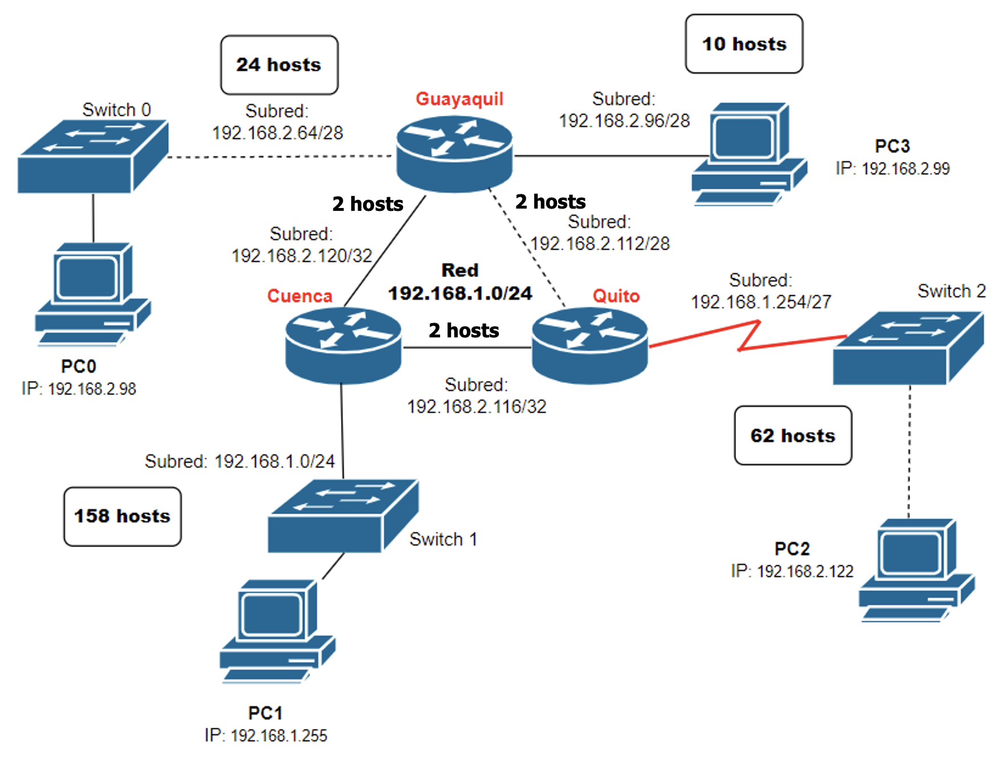

[Regresar](/Programacion-de-Sistemas-Telematicos/)

# Trabajo Autónomo 1 División de subredes con direccionamiento IPv4

## 🎯 Objetivo de Aprendizaje
Efectuar cálculos de direccionamiento IP usando diagramas de arquitectura para la comunicación entre diferentes redes.

**Recursos:** Procesador de texto, lápiz, papel, calculadora.

**Duración:** 6 horas.

**Instrucciones**

- Mantener el formato del trabajo proporcionado.
Los trabajos se reciben hasta la fecha planificada en el Aula Virtual.
- El ejercicio 0 será resuelto en la sesión de clase con la explicación de la docente.
- Coloque el nombre del archivo así “PST_P#_TAA_Apellido_Nombre”, siendo # el paralelo, A el número del trabajo.
- Una vez que haya desarrollado el trabajo, cada integrante del grupo contestará la encuesta de evaluación de los trabajos autónomos ingresando a https://bit.ly/3jIH3yJ

**Introducción**

Una dirección IP se utiliza para identificar a un dispositivo en una red, por lo que es única dentro de los límites de dicha red. La dirección se compone de 32 bits binarios, mismos que pueden dividirse en una porción correspondiente a la red y otra a hosts, con la ayuda de una máscara de subred.
Los 32 bits binarios se encuentran divididos en 4 octetos, cada uno con 8 bits. Cada octeto binario se convierte a decimal (en el rango de 0-255) y se separa por un punto, es así como una IP puede representarse de la siguiente manera: 192.168.19.0/26, donde:
192.168.10.10/26

Los octetos binarios se convierten a decimales, considerando que los bits desde la derecha a la izquierda siguen la secuencia de una potencia de base 2, como se muestra en la Figura 1.

Figura 1. Traducción de sistema binario a decimal

Según la máscara de subred, las direcciones IP pueden clasificarse en clases, desde la A hasta la E (Figura 2). La clase de una dirección IP se puede determinar a partir de los tres bits del extremo 

izquierdo en el primer octeto. 

El siguiente trabajo autónomo tiene como propósito que el estudiante pueda desarrollar actividades relacionadas al cálculo de división de subredes usando direccionamiento IPv4 para un sistema en red.

## ACTIVIDADES

1.	Efectuar el cálculo de división de subredes usando el direccionamiento IPv4 propuesto en los 5 escenarios. A continuación, se presenta un escenario con la resolución, el cual fue explicado durante la sesión de clase **(30 puntos)**: 

<<<<<<< Updated upstream

<table class="tg" style="undefined;table-layout: fixed; width: 646px">
<colgroup>
<col style="width: 304px">
<col style="width: 342px">
</colgroup>
<thead>
  <tr>
<<<<<<< HEAD
    <th class="tg-l49g" colspan="2">Escenario 0 (Resuelto)</th>
=======

**Escenario 1**

<table class="tg">
<thead>
  <tr>
    <th class="tg-7btt" colspan="2">Escenario 1</th>
>>>>>>> Stashed changes
=======
    <th class="tg-l49g" colspan="2">Escenario 0 [Resuelto]</th>
>>>>>>> 36626492f1ca1e3503cd75ef6d3bbf475b291de4
  </tr>
</thead>
<tbody>
  <tr>
<<<<<<< Updated upstream
    <td class="tg-mcqj">Número de segmentos físicos:</td>
    <td class="tg-73oq">5</td>
  </tr>
  <tr>
    <td class="tg-mcqj">Máximo número de hosts:</td>
    <td class="tg-73oq">5000</td>
  </tr>
  <tr>
    <td class="tg-mcqj">Dirección de red:</td>
    <td class="tg-73oq">152.77.0.0</td>
  </tr>
  <tr>
<<<<<<< HEAD
    <td class="tg-mcqj">Número de subredes soportadas:</td>
    <td class="tg-73oq">2=8 subredes</td>
  </tr>
  <tr>
    <td class="tg-mcqj">Máscara de subred propuesta:</td>
    <td class="tg-73oq">11111111.11111111.11100000.00000000  =255.255.224.0 = Prefijo CIDR= /19  Explicación: Una vez que tengo cuantas subredes y hosts me pide el ejercicio, tomo los 3 bits encendidos para subredes y 13 bits apagados para hosts, pero solo tomaré el tercer octeto que tiene la parte variable con los 5 bits apagados para formar 2 5 = 32 saltos como se muestra a continuación.</td>
=======
<td class="tg-mcqj">Número de subredes soportadas:</td>
    <td class="tg-73oq">23 = 8 subredes</td>
  </tr>
  <tr>
<td class="tg-mcqj">Máximo número de hosts por subred:</td>
    <td class="tg-73oq">213= 8192 - 2 = 8190 hosts subredes</td>
  </tr>
  <tr>
    <td class="tg-mcqj">Máscara de subred propuesta:</td>
    <td class="tg-73oq">11111111.11111111.11100000.00000000  = 255.255.224.0 = Prefijo CIDR= /19  Explicación: Una vez que tengo cuantas subredes y hosts me pide el ejercicio, tomo los 3 bits encendidos para subredes y 13 bits apagados para hosts, pero solo tomaré el tercer octeto que tiene la parte variable con los 5 bits apagados para formar 25 = 32 saltos como se muestra a continuación.</td>
>>>>>>> 36626492f1ca1e3503cd75ef6d3bbf475b291de4
  </tr>
  <tr>
    <td class="tg-mqa1">Subred</td>
    <td class="tg-mqa1">Primera dirección host - Última dirección host válida</td>
  </tr>
  <tr>
    <td class="tg-mcqj">152.77.0.0</td>
    <td class="tg-73oq">152.77.0.1 – 152.77.31.254</td>
  </tr>
  <tr>
    <td class="tg-mcqj">152.77.32.0</td>
    <td class="tg-73oq">152.77.32.1 – 152.77.63.254</td>
  </tr>
  <tr>
    <td class="tg-mcqj">152.77.64.0</td>
    <td class="tg-73oq">152.77.64.1 – 152.77.95.254</td>
  </tr>
  <tr>
    <td class="tg-mcqj">152.77.96.0</td>
    <td class="tg-73oq">152.77.96.1 – 152.77.127.254</td>
  </tr>
  <tr>
    <td class="tg-mcqj">152.77.128.0</td>
    <td class="tg-73oq">152.77.128.1 – 152.77.159.254</td>
  </tr>
  <tr>
    <td class="tg-mcqj">152.77.160.0</td>
    <td class="tg-73oq">152.77.160.1 – 152.77.191.254</td>
  </tr>
  <tr>
    <td class="tg-mcqj">152.77.192.0</td>
    <td class="tg-73oq">152.77.192.1 – 152.77.223.254</td>
  </tr>
  <tr>
  <td class="tg-73oq">152.77.224.0</td>
  <td class="tg-73oq">152.77.224.1 – 152.77.255.254</td>
  </tr>
</tbody>
<<<<<<< HEAD
</table>
=======
   

**Escenario 2**
=======

 
 

<table class="tg" style="undefined;table-layout: fixed; width: 646px">
<colgroup>
<col style="width: 304px">
<col style="width: 342px">
</colgroup>
<thead>
  <tr>
    <th class="tg-l49g" colspan="2">Escenario 1</th>
  </tr>
</thead>
<tbody>
  <tr>
    <td class="tg-mcqj">Número de segmentos físicos:</td>
    <td class="tg-0pky">28</td>
  </tr>
  <tr>
    <td class="tg-mcqj">Máximo número de hosts:</td>
    <td class="tg-0pky">1981</td>
  </tr>
  <tr>
        <td class="tg-mcqj">Dirección de red:</td>
    <td class="tg-0pky">176.7.0.0</td>
  </tr>
  <tr>
<td class="tg-mcqj">Número de subredes soportadas:</td>
    <td class="tg-0pky">     </td>
  </tr>
  <tr>
    <td class="tg-mcqj">Máximo número de hosts por subred:</td>
    <td class="tg-0pky">     </td>
  </tr>
  <tr>
     <td class="tg-mcqj">Máscara de subred propuesta: </td>
    <td class="tg-0pky">          </td>
  </tr>
  <tr>
    <td class="tg-mqa1">Subred</td>
    <td class="tg-mqa1">Primera dirección host - Última dirección host válida</td>
  </tr>
</tbody>
</table>

 

<table class="tg" style="undefined;table-layout: fixed; width: 646px">
<colgroup>
<col style="width: 304px">
<col style="width: 342px">
</colgroup>
<thead>
  <tr>
    <th class="tg-l49g" colspan="2">Escenario 2</th>
  </tr>
</thead>
<tbody>
  <tr>
   <td class="tg-mcqj">Número de segmentos físicos:</td>
    <td class="tg-0lax">30</td>
  </tr>
  <tr>
    <td class="tg-mcqj">Máximo número de hosts:</td>
    <td class="tg-0lax">5</td>
  </tr>
  <tr>
    <td class="tg-mcqj">Dirección de red:</td>
    <td class="tg-0lax">210.20.10.0</td>
  </tr>
  <tr>
<td class="tg-mcqj">Número de subredes soportadas:</td>
    <td class="tg-0pky">     </td>
  </tr>
  <tr>
    <td class="tg-mcqj">Máximo número de hosts por subred:</td>
    <td class="tg-0pky">     </td>
  </tr>
  <tr>
     <td class="tg-mcqj">Máscara de subred propuesta: </td>
    <td class="tg-0pky">          </td>
  </tr>
  <tr>
    <td class="tg-mqa1">Subred</td>
    <td class="tg-mqa1">Primera dirección host - Última dirección host válida</td>
  </tr>
</tbody>
</table>

 
>>>>>>> 36626492f1ca1e3503cd75ef6d3bbf475b291de4

<table class="tg" style="undefined;table-layout: fixed; width: 646px">
<colgroup>
<col style="width: 304px">
<col style="width: 342px">
</colgroup>
<thead>
  <tr>
    <th class="tg-l49g" colspan="2">Escenario 3</th>
  </tr>
</thead>
<tbody>
  <tr>
    <td class="tg-mcqj">Número de segmentos físicos:</td>
    <td class="tg-0lax">58</td>
  </tr>
  <tr>
    <td class="tg-mcqj">Máximo número de hosts:</td>
    <td class="tg-0lax">185230</td>
  </tr>
  <tr>
  <td class="tg-mcqj">Dirección de red:</td>
    <td class="tg-0lax">180.0.0.0</td>
  </tr>
<tr>
<td class="tg-mcqj">Número de subredes soportadas:</td>
    <td class="tg-0pky">     </td>
  </tr>
  <tr>
    <td class="tg-mcqj">Máximo número de hosts por subred:</td>
    <td class="tg-0pky">     </td>
  </tr>
  <tr>
     <td class="tg-mcqj">Máscara de subred propuesta: </td>
    <td class="tg-0pky">          </td>
  </tr>
  <tr>
    <td class="tg-mqa1">Subred</td>
    <td class="tg-mqa1">Primera dirección host - Última dirección host válida</td>
  </tr>
</tbody>
</table>

 

<table class="tg" style="undefined;table-layout: fixed; width: 646px">
<colgroup>
<col style="width: 304px">
<col style="width: 342px">
</colgroup>
<thead>
  <tr>
    <th class="tg-l49g" colspan="2">Escenario 4</th>
  </tr>
</thead>
<tbody>
  <tr>
    <td class="tg-mcqj">Número de segmentos físicos:</td>
    <td class="tg-0lax" colspan="2">140</td>
  </tr>
  <tr>
    <td class="tg-mcqj">Máximo número de hosts:</td>
    <td class="tg-0lax" colspan="2">180</td>
  </tr>
  <tr>
<td class="tg-mcqj">Dirección de red:</td>
    <td class="tg-0lax" colspan="2">195.18.5.0</td>
  </tr>
<tr>
<td class="tg-mcqj">Número de subredes soportadas:</td>
    <td class="tg-0pky">     </td>
  </tr>
  <tr>
    <td class="tg-mcqj">Máximo número de hosts por subred:</td>
    <td class="tg-0pky">     </td>
  </tr>
  <tr>
     <td class="tg-mcqj">Máscara de subred propuesta: </td>
    <td class="tg-0pky">          </td>
  </tr>
  <tr>
    <td class="tg-mqa1">Subred</td>
    <td class="tg-mqa1">Primera dirección host - Última dirección host válida</td>
  </tr>
</tbody>
</table>

 

<table class="tg" style="undefined;table-layout: fixed; width: 646px">
<colgroup>
<col style="width: 304px">
<col style="width: 342px">
</colgroup>
<thead>
  <tr>
    <th class="tg-l49g" colspan="2">Escenario 5</th>
  </tr>
</thead>
<tbody>
  <tr>
    <td class="tg-mcqj">Número de segmentos físicos:</td>
    <td class="tg-0lax">3</td>
    <td class="tg-0lax"></td>
  </tr>
  <tr>
    <td class="tg-mcqj">Máximo número de hosts:</td>
    <td class="tg-0lax">56</td>
    <td class="tg-0lax"></td>
  </tr>
  <tr>
<td class="tg-mcqj">Dirección de red:</td>
    <td class="tg-0lax">192.115.30.0</td>
    <td class="tg-0lax"></td>
  </tr>
<tr>
<td class="tg-mcqj">Número de subredes soportadas:</td>
    <td class="tg-0pky">     </td>
  </tr>
  <tr>
    <td class="tg-mcqj">Máximo número de hosts por subred:</td>
    <td class="tg-0pky">     </td>
  </tr>
  <tr>
     <td class="tg-mcqj">Máscara de subred propuesta: </td>
    <td class="tg-0pky">          </td>
  </tr>
  <tr>
    <td class="tg-mqa1">Subred</td>
    <td class="tg-mqa1">Primera dirección host - Última dirección host válida</td>
  </tr>
</tbody>
</table>

 

2. Determine  la  dirección de subred,  dirección  de  difusión (broadcast) y el rango de hosts válidos **10 puntos**: 
 
 
- 180.42.67.2/19

- 176.128.64.40/23

- 107.194.140.27/14

- 230.53.192.37/10

- 192.18.81.4/17

 
 
3. Dada una red de Clase B y los bits de red identificados (CIDR), complete la siguiente tabla para identificar la máscara de subred y el número de direcciones de host posibles para cada máscara **(10 puntos)**:

 

<table class="tg">
<thead>
  <tr>
    <th class="tg-l49g" colspan="1">CIDR</th>
    <th class="tg-l49g" colspan="1">Máscara de subred (formato decimal)</th>
    <th class="tg-l49g" colspan="1">Número de host por subred (2 x  - 2)</th>
  </tr>
</thead>
<tbody>
  <tr>
    <td class="tg-amwm">/14</td>
    <td class="tg-0lax"></td>
    <td class="tg-0lax"></td>
  </tr>
  <tr>
    <td class="tg-amwm">/26</td>
    <td class="tg-0lax">     </td>
    <td class="tg-0lax">     </td>
  </tr>
  <tr>
    <td class="tg-amwm">/18</td>
    <td class="tg-0lax"></td>
    <td class="tg-0lax"></td>
  </tr>
  <tr>
    <td class="tg-amwm">/20</td>
    <td class="tg-0lax">     </td>
    <td class="tg-0lax">     </td>
  </tr>
  <tr>
    <td class="tg-amwm">/31</td>
    <td class="tg-0lax">     </td>
    <td class="tg-0lax">     </td>
  </tr>
</tbody>
</table>

 
 

<<<<<<< HEAD
>>>>>>> Stashed changes
=======
4. La empresa de desarrollo de software AditaTech S.A. tiene 3 puntos que son la matriz en Guayaquil, las sucursales en Quito y Cuenca. La dirección de red usada en los puntos es 192.168.1.0/24. Acorde a la topología de la red proporcionada, identifique los problemas existentes detallando en qué capa del Modelo OSI ocurren estos problemas, y a la vez proponga una solución a cada problema. **(40 puntos)**

  

 
 

## Desafío

5. Determinar la IP pública y privada de su dispositivo de usuario final. Se admiten imágenes en las respuestas. **(10 puntos)**
>>>>>>> 36626492f1ca1e3503cd75ef6d3bbf475b291de4
