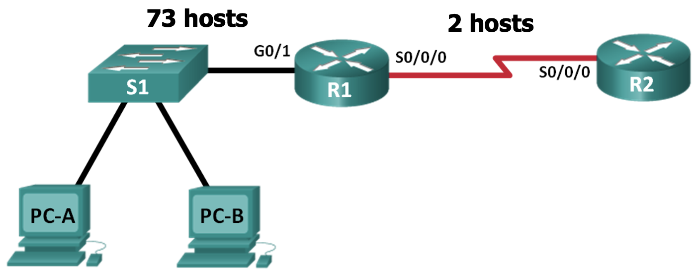
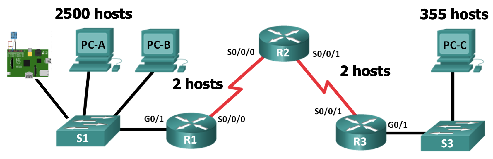
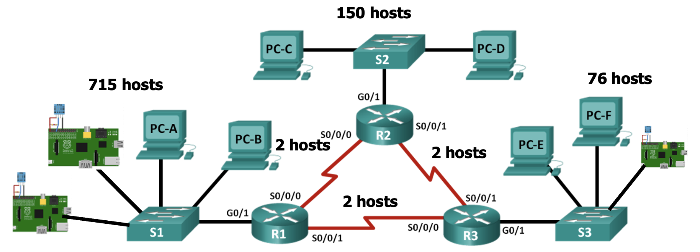
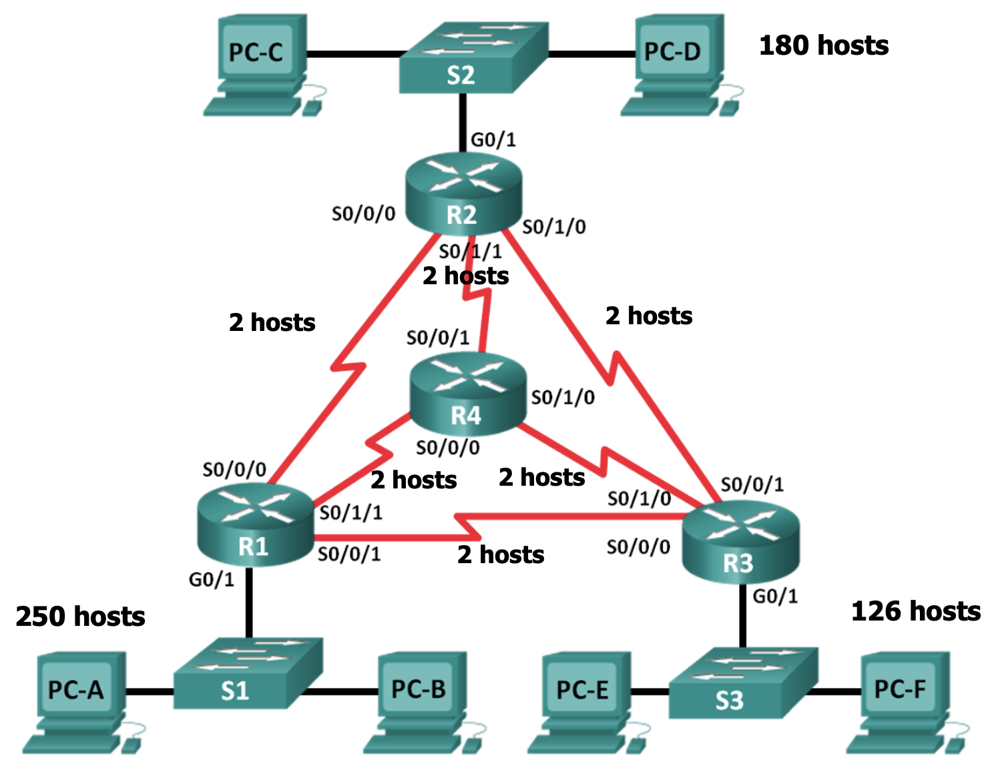
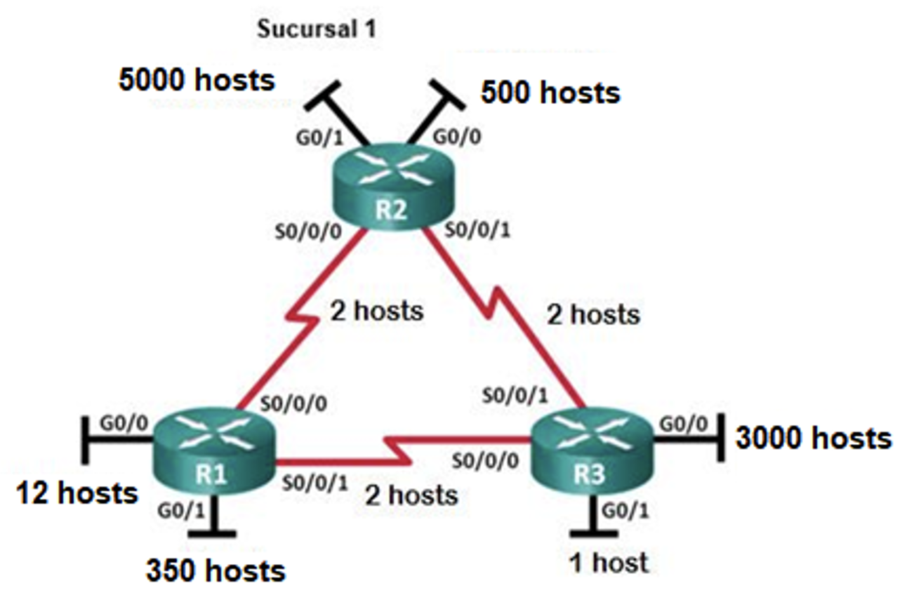

[Regresar](/Programacion-de-Sistemas-Telematicos/)

# Trabajo Autónomo 2 Aprovisionamiento de direcciones IPv4 en una red empresarial

## 🎯 Objetivo de Aprendizaje
Efectuar cálculos de direccionamiento IP usando diagramas de arquitectura para la comunicación entre diferentes redes.

**Recursos:** Procesador de texto, papel, lápiz

**Duración:**	8 horas.

**Instrucciones**

- El formato del trabajo tiene habilitado recuadros de color amarillo para que llenen las respuestas de los ejercicios.
- Los trabajos se reciben hasta la fecha planificada en el Aula Virtual.
o	El ejercicio 0 será resuelto en la sesión de clase con la explicación de la docente.
- Coloque el nombre del archivo así “PST_TAA_Apellido”, siendo A el número del trabajo.
- Una vez que haya desarrollado el trabajo, contestará la encuesta de evaluación de los trabajos autónomos ingresando al enlace https://forms.gle/oZnGiwGyDB1LJf5w5

**Introducción**

Dentro de una red es esencial que cada dispositivo posea un identificador único, es por ello que el direccionamiento es una función clave de los protocolos de capa de red. Dado que facilita la distribución y asignación de IP para cada dispositivo dentro de una subred, permitiendo la transmisión de datos entre hosts de la misma red o en redes diferentes. El Protocolo de Internet versión 4 (IPv4) ofrece direccionamiento jerárquico para paquetes que transportan datos. La correcta implementación, diseño y administración de un plan de direccionamiento IPv4 garantiza que las redes puedan operar de manera eficiente y eficaz. 

En cada red IPv4 existen tres tipos de direcciones: 
- Dirección de red: Es la dirección que referencia a la red o subred.
- Dirección de broadcast: Es la dirección reservada para la transmisión de datos a todos los hosts de una red o subred. 
-	Direcciones de host: Son las direcciones IP válidas que se pueden asignar a los dispositivos que formen parte de la red.

Es importante destacar que una red según su topología y requerimientos puede dividirse en varias subredes, mismas que integran un único sistema. 
En el presente trabajo autónomo se proponen actividades relacionadas al aprovisionamiento de direcciones IPv4 para dispositivos de red, sistemas embebidos en una red empresarial. De manera que el estudiante pueda efectuar el cálculo de subredes a partir de topologías de red para la comunicación entre sistemas telemáticos.

## ACTIVIDADES

## **Topología de la red A [Resuelto]**
Contiene el proceso explicado con la resolución correspondiente. (Ejemplo)
En la parte 1, se otorgó la dirección de red 192.168.10.0/24 a la subred, con la siguiente topología. Determine la cantidad de redes necesarias y luego diseñe un esquema de direccionamiento adecuado.

  

 
 

**Paso 1:	Determine la cantidad de subredes en la topología de la red A.**

- ¿Cuántas subredes hay? 
2 subredes 

- ¿Cuántos bits debe tomar prestados para crear la cantidad de subredes requeridas?

  1 bit para la primera subred y 6 bits para la segunda subred.

   
  11111111.11111111.11111111.10000000 = 21=2 subredes, 27=128-2=126 hosts

  11111111.11111111.11111111.11111100 = 26=64 subredes, 22=4-2=2 hosts
   

-	¿Cuántas direcciones de host utilizables por subred se encuentran en este esquema de direccionamiento?
  27=128-2=126 hosts, 22=4-2=2 hosts

-	¿Cuál es la máscara de subred nueva en formato decimal punteado?
  255.255.255.128 - 255.255.255.252

-	¿Cuántas subredes quedan disponibles para usar en el futuro?
  192.168.10.132 - 192.168.10.255

**Paso 2:	Registre la información de subred.
Complete la siguiente tabla con la información de la subred:**

 

<table class="tg">
<thead>
  <tr>
    <th class="tg-mqa1">Número de subred</th>
    <th class="tg-mqa1">Dirección de subred</th>
    <th class="tg-mqa1">Primera dirección de host utilizable</th>
    <th class="tg-mqa1">Última dirección de host utilizable</th>
    <th class="tg-mqa1">Dirección de broadcast</th>
  </tr>
</thead>
<tbody>
  <tr>
    <td class="tg-1zis">1</td>
    <td class="tg-1zis">192.168.10.0</td>
    <td class="tg-1zis">192.168.10.1</td>
    <td class="tg-1zis">192.168.10.126</td>
    <td class="tg-1zis">192.168.10.127</td>
  </tr>
  <tr>
    <td class="tg-1zis">2</td>
    <td class="tg-1zis">192.168.10.128</td>
    <td class="tg-1zis">192.168.10.129</td>
    <td class="tg-1zis">192.168.10.130</td>
    <td class="tg-1zis">192.168.10.131</td>
  </tr>
</tbody>
</table>
 

## **Topología de la red B (20 puntos)** 
La topología de la red de la parte 1 se expandió para admitir el agregado del router R3 y la red complementaria, como se ilustra en la topología siguiente. Utilice la dirección de red 190.95.0.0/16 para proporcionar direcciones a los dispositivos de red y luego diseñe un nuevo esquema de direccionamiento para admitir el requisito de red adicional.

  
 
 

**Paso 1: Determine la cantidad de subredes en la topología de la red B.**

a)	¿Cuántas subredes existen y a qué tipo de clase pertenecen cada una?.

     
b)	¿Cuántos bits debe tomar prestados para crear la cantidad de subredes requeridas?.

c)	¿Cuántas direcciones de host utilizables por subred se encuentran en este esquema de direccionamiento?.

     
d)	¿Cuál es la máscara de subred nueva en formato decimal punteado?.

     
e)	¿Cuántas subredes quedan disponibles para usar en el futuro?.
     
 

**Paso 2: Registre la información de subred.
Complete la siguiente tabla con la información de la subred:**

 
<table style="border-collapse:collapse;border-color:#9ABAD9;border-spacing:0" class="tg"><thead><tr><th style="background-color:#409cff;border-color:#000000;border-style:solid;border-width:1px;color:#fff;font-family:Arial, sans-serif;font-size:14px;font-weight:bold;overflow:hidden;padding:10px 5px;text-align:center;vertical-align:top;word-break:normal">Número de subred</th><th style="background-color:#409cff;border-color:#000000;border-style:solid;border-width:1px;color:#fff;font-family:Arial, sans-serif;font-size:14px;font-weight:bold;overflow:hidden;padding:10px 5px;text-align:center;vertical-align:top;word-break:normal">Dirección de subred</th><th style="background-color:#409cff;border-color:#000000;border-style:solid;border-width:1px;color:#fff;font-family:Arial, sans-serif;font-size:14px;font-weight:bold;overflow:hidden;padding:10px 5px;text-align:center;vertical-align:top;word-break:normal">Primera dirección de host utilizable</th><th style="background-color:#409cff;border-color:#000000;border-style:solid;border-width:1px;color:#fff;font-family:Arial, sans-serif;font-size:14px;font-weight:bold;overflow:hidden;padding:10px 5px;text-align:center;vertical-align:top;word-break:normal">Última dirección de host utilizable</th><th style="background-color:#409cff;border-color:#000000;border-style:solid;border-width:1px;color:#fff;font-family:Arial, sans-serif;font-size:14px;font-weight:bold;overflow:hidden;padding:10px 5px;text-align:center;vertical-align:top;word-break:normal">Dirección de broadcast</th></tr></thead><tbody><tr><td style="background-color:#EBF5FF;border-color:#000000;border-style:solid;border-width:1px;color:#000000;font-family:Arial, sans-serif;font-size:14px;overflow:hidden;padding:10px 5px;text-align:center;vertical-align:top;word-break:normal">1</td><td style="background-color:#EBF5FF;border-color:#000000;border-style:solid;border-width:1px;color:#000000;font-family:Arial, sans-serif;font-size:14px;overflow:hidden;padding:10px 5px;text-align:center;vertical-align:top;word-break:normal"></td><td style="background-color:#EBF5FF;border-color:#000000;border-style:solid;border-width:1px;color:#000000;font-family:Arial, sans-serif;font-size:14px;overflow:hidden;padding:10px 5px;text-align:center;vertical-align:top;word-break:normal"></td><td style="background-color:#EBF5FF;border-color:#000000;border-style:solid;border-width:1px;color:#000000;font-family:Arial, sans-serif;font-size:14px;overflow:hidden;padding:10px 5px;text-align:center;vertical-align:top;word-break:normal"></td><td style="background-color:#EBF5FF;border-color:#000000;border-style:solid;border-width:1px;color:#000000;font-family:Arial, sans-serif;font-size:14px;overflow:hidden;padding:10px 5px;text-align:center;vertical-align:top;word-break:normal"></td></tr><tr><td style="background-color:#EBF5FF;border-color:#000000;border-style:solid;border-width:1px;color:#000000;font-family:Arial, sans-serif;font-size:14px;overflow:hidden;padding:10px 5px;text-align:center;vertical-align:top;word-break:normal">2</td><td style="background-color:#EBF5FF;border-color:#000000;border-style:solid;border-width:1px;color:#000000;font-family:Arial, sans-serif;font-size:14px;overflow:hidden;padding:10px 5px;text-align:center;vertical-align:top;word-break:normal"></td><td style="background-color:#EBF5FF;border-color:#000000;border-style:solid;border-width:1px;color:#000000;font-family:Arial, sans-serif;font-size:14px;overflow:hidden;padding:10px 5px;text-align:center;vertical-align:top;word-break:normal"></td><td style="background-color:#EBF5FF;border-color:#000000;border-style:solid;border-width:1px;color:#000000;font-family:Arial, sans-serif;font-size:14px;overflow:hidden;padding:10px 5px;text-align:center;vertical-align:top;word-break:normal"></td><td style="background-color:#EBF5FF;border-color:#000000;border-style:solid;border-width:1px;color:#000000;font-family:Arial, sans-serif;font-size:14px;overflow:hidden;padding:10px 5px;text-align:center;vertical-align:top;word-break:normal"></td></tr><tr><td style="background-color:#EBF5FF;border-color:#000000;border-style:solid;border-width:1px;color:#444;font-family:Arial, sans-serif;font-size:14px;overflow:hidden;padding:10px 5px;text-align:center;vertical-align:top;word-break:normal">3</td><td style="background-color:#EBF5FF;border-color:#000000;border-style:solid;border-width:1px;color:#444;font-family:Arial, sans-serif;font-size:14px;overflow:hidden;padding:10px 5px;text-align:left;vertical-align:top;word-break:normal"></td><td style="background-color:#EBF5FF;border-color:#000000;border-style:solid;border-width:1px;color:#444;font-family:Arial, sans-serif;font-size:14px;overflow:hidden;padding:10px 5px;text-align:left;vertical-align:top;word-break:normal"></td><td style="background-color:#EBF5FF;border-color:#000000;border-style:solid;border-width:1px;color:#444;font-family:Arial, sans-serif;font-size:14px;overflow:hidden;padding:10px 5px;text-align:left;vertical-align:top;word-break:normal"></td><td style="background-color:#EBF5FF;border-color:#000000;border-style:solid;border-width:1px;color:#444;font-family:Arial, sans-serif;font-size:14px;overflow:hidden;padding:10px 5px;text-align:left;vertical-align:top;word-break:normal"></td></tr><tr><td style="background-color:#EBF5FF;border-color:#000000;border-style:solid;border-width:1px;color:#444;font-family:Arial, sans-serif;font-size:14px;overflow:hidden;padding:10px 5px;text-align:center;vertical-align:top;word-break:normal">4</td><td style="background-color:#EBF5FF;border-color:#000000;border-style:solid;border-width:1px;color:#444;font-family:Arial, sans-serif;font-size:14px;overflow:hidden;padding:10px 5px;text-align:left;vertical-align:top;word-break:normal"></td><td style="background-color:#EBF5FF;border-color:#000000;border-style:solid;border-width:1px;color:#444;font-family:Arial, sans-serif;font-size:14px;overflow:hidden;padding:10px 5px;text-align:left;vertical-align:top;word-break:normal"></td><td style="background-color:#EBF5FF;border-color:#000000;border-style:solid;border-width:1px;color:#444;font-family:Arial, sans-serif;font-size:14px;overflow:hidden;padding:10px 5px;text-align:left;vertical-align:top;word-break:normal"></td><td style="background-color:#EBF5FF;border-color:#000000;border-style:solid;border-width:1px;color:#444;font-family:Arial, sans-serif;font-size:14px;overflow:hidden;padding:10px 5px;text-align:left;vertical-align:top;word-break:normal"></td></tr><tr><td style="background-color:#EBF5FF;border-color:#000000;border-style:solid;border-width:1px;color:#444;font-family:Arial, sans-serif;font-size:14px;overflow:hidden;padding:10px 5px;text-align:center;vertical-align:top;word-break:normal">5</td><td style="background-color:#EBF5FF;border-color:#000000;border-style:solid;border-width:1px;color:#444;font-family:Arial, sans-serif;font-size:14px;overflow:hidden;padding:10px 5px;text-align:left;vertical-align:top;word-break:normal"></td><td style="background-color:#EBF5FF;border-color:#000000;border-style:solid;border-width:1px;color:#444;font-family:Arial, sans-serif;font-size:14px;overflow:hidden;padding:10px 5px;text-align:left;vertical-align:top;word-break:normal"></td><td style="background-color:#EBF5FF;border-color:#000000;border-style:solid;border-width:1px;color:#444;font-family:Arial, sans-serif;font-size:14px;overflow:hidden;padding:10px 5px;text-align:left;vertical-align:top;word-break:normal"></td><td style="background-color:#EBF5FF;border-color:#000000;border-style:solid;border-width:1px;color:#444;font-family:Arial, sans-serif;font-size:14px;overflow:hidden;padding:10px 5px;text-align:left;vertical-align:top;word-break:normal"></td></tr></tbody></table>
 
 

## **Topología de la red C (20 puntos)**

La topología volvió a cambiar con una LAN nueva agregada al R2 y un enlace redundante entre R1 y R3. Utilice la dirección de red 190.95.0.0/16 para proporcionar direcciones a los dispositivos de red. También proporcione un esquema de direcciones IP que admita estos dispositivos adicionales. Para esta topología, asigne una subred a cada red.

 

  

 
 

**Paso 1: Determine la cantidad de subredes en la topología de la red C.**

 
- ¿Cuántas subredes existen y a qué tipo de clase pertenecen cada una?.
     

- ¿Cuántos bits debe tomar prestados para crear la cantidad de subredes requeridas?.

      
- ¿Cuántas direcciones de host utilizables por subred se encuentran en este esquema de direccionamiento?.

     
- ¿Cuál es la máscara de subred nueva en formato decimal punteado?. 
     

- ¿Cuántas subredes quedan disponibles para usar en el futuro?. 

 
 

**Paso 2: Registre la información de subred.**

 
<table style="border-collapse:collapse;border-color:#9ABAD9;border-spacing:0" class="tg"><thead><tr><th style="background-color:#409cff;border-color:#000000;border-style:solid;border-width:1px;color:#fff;font-family:Arial, sans-serif;font-size:14px;font-weight:bold;overflow:hidden;padding:10px 5px;text-align:center;vertical-align:top;word-break:normal">Número de subred</th><th style="background-color:#409cff;border-color:#000000;border-style:solid;border-width:1px;color:#fff;font-family:Arial, sans-serif;font-size:14px;font-weight:bold;overflow:hidden;padding:10px 5px;text-align:center;vertical-align:top;word-break:normal">Dirección de subred</th><th style="background-color:#409cff;border-color:#000000;border-style:solid;border-width:1px;color:#fff;font-family:Arial, sans-serif;font-size:14px;font-weight:bold;overflow:hidden;padding:10px 5px;text-align:center;vertical-align:top;word-break:normal">Primera dirección de host utilizable</th><th style="background-color:#409cff;border-color:#000000;border-style:solid;border-width:1px;color:#fff;font-family:Arial, sans-serif;font-size:14px;font-weight:bold;overflow:hidden;padding:10px 5px;text-align:center;vertical-align:top;word-break:normal">Última dirección de host utilizable</th><th style="background-color:#409cff;border-color:#000000;border-style:solid;border-width:1px;color:#fff;font-family:Arial, sans-serif;font-size:14px;font-weight:bold;overflow:hidden;padding:10px 5px;text-align:center;vertical-align:top;word-break:normal">Dirección de broadcast</th></tr></thead><tbody><tr><td style="background-color:#EBF5FF;border-color:#000000;border-style:solid;border-width:1px;color:#000000;font-family:Arial, sans-serif;font-size:14px;overflow:hidden;padding:10px 5px;text-align:center;vertical-align:top;word-break:normal">1</td><td style="background-color:#EBF5FF;border-color:#000000;border-style:solid;border-width:1px;color:#000000;font-family:Arial, sans-serif;font-size:14px;overflow:hidden;padding:10px 5px;text-align:center;vertical-align:top;word-break:normal"></td><td style="background-color:#EBF5FF;border-color:#000000;border-style:solid;border-width:1px;color:#000000;font-family:Arial, sans-serif;font-size:14px;overflow:hidden;padding:10px 5px;text-align:center;vertical-align:top;word-break:normal"></td><td style="background-color:#EBF5FF;border-color:#000000;border-style:solid;border-width:1px;color:#000000;font-family:Arial, sans-serif;font-size:14px;overflow:hidden;padding:10px 5px;text-align:center;vertical-align:top;word-break:normal"></td><td style="background-color:#EBF5FF;border-color:#000000;border-style:solid;border-width:1px;color:#000000;font-family:Arial, sans-serif;font-size:14px;overflow:hidden;padding:10px 5px;text-align:center;vertical-align:top;word-break:normal"></td></tr><tr><td style="background-color:#EBF5FF;border-color:#000000;border-style:solid;border-width:1px;color:#000000;font-family:Arial, sans-serif;font-size:14px;overflow:hidden;padding:10px 5px;text-align:center;vertical-align:top;word-break:normal">2</td><td style="background-color:#EBF5FF;border-color:#000000;border-style:solid;border-width:1px;color:#000000;font-family:Arial, sans-serif;font-size:14px;overflow:hidden;padding:10px 5px;text-align:center;vertical-align:top;word-break:normal"></td><td style="background-color:#EBF5FF;border-color:#000000;border-style:solid;border-width:1px;color:#000000;font-family:Arial, sans-serif;font-size:14px;overflow:hidden;padding:10px 5px;text-align:center;vertical-align:top;word-break:normal"></td><td style="background-color:#EBF5FF;border-color:#000000;border-style:solid;border-width:1px;color:#000000;font-family:Arial, sans-serif;font-size:14px;overflow:hidden;padding:10px 5px;text-align:center;vertical-align:top;word-break:normal"></td><td style="background-color:#EBF5FF;border-color:#000000;border-style:solid;border-width:1px;color:#000000;font-family:Arial, sans-serif;font-size:14px;overflow:hidden;padding:10px 5px;text-align:center;vertical-align:top;word-break:normal"></td></tr><tr><td style="background-color:#EBF5FF;border-color:#000000;border-style:solid;border-width:1px;color:#444;font-family:Arial, sans-serif;font-size:14px;overflow:hidden;padding:10px 5px;text-align:center;vertical-align:top;word-break:normal">3</td><td style="background-color:#EBF5FF;border-color:#000000;border-style:solid;border-width:1px;color:#444;font-family:Arial, sans-serif;font-size:14px;overflow:hidden;padding:10px 5px;text-align:left;vertical-align:top;word-break:normal"></td><td style="background-color:#EBF5FF;border-color:#000000;border-style:solid;border-width:1px;color:#444;font-family:Arial, sans-serif;font-size:14px;overflow:hidden;padding:10px 5px;text-align:left;vertical-align:top;word-break:normal"></td><td style="background-color:#EBF5FF;border-color:#000000;border-style:solid;border-width:1px;color:#444;font-family:Arial, sans-serif;font-size:14px;overflow:hidden;padding:10px 5px;text-align:left;vertical-align:top;word-break:normal"></td><td style="background-color:#EBF5FF;border-color:#000000;border-style:solid;border-width:1px;color:#444;font-family:Arial, sans-serif;font-size:14px;overflow:hidden;padding:10px 5px;text-align:left;vertical-align:top;word-break:normal"></td></tr><tr><td style="background-color:#EBF5FF;border-color:#000000;border-style:solid;border-width:1px;color:#444;font-family:Arial, sans-serif;font-size:14px;overflow:hidden;padding:10px 5px;text-align:center;vertical-align:top;word-break:normal">4</td><td style="background-color:#EBF5FF;border-color:#000000;border-style:solid;border-width:1px;color:#444;font-family:Arial, sans-serif;font-size:14px;overflow:hidden;padding:10px 5px;text-align:left;vertical-align:top;word-break:normal"></td><td style="background-color:#EBF5FF;border-color:#000000;border-style:solid;border-width:1px;color:#444;font-family:Arial, sans-serif;font-size:14px;overflow:hidden;padding:10px 5px;text-align:left;vertical-align:top;word-break:normal"></td><td style="background-color:#EBF5FF;border-color:#000000;border-style:solid;border-width:1px;color:#444;font-family:Arial, sans-serif;font-size:14px;overflow:hidden;padding:10px 5px;text-align:left;vertical-align:top;word-break:normal"></td><td style="background-color:#EBF5FF;border-color:#000000;border-style:solid;border-width:1px;color:#444;font-family:Arial, sans-serif;font-size:14px;overflow:hidden;padding:10px 5px;text-align:left;vertical-align:top;word-break:normal"></td></tr><tr><td style="background-color:#EBF5FF;border-color:#000000;border-style:solid;border-width:1px;color:#444;font-family:Arial, sans-serif;font-size:14px;overflow:hidden;padding:10px 5px;text-align:center;vertical-align:top;word-break:normal">5</td><td style="background-color:#EBF5FF;border-color:#000000;border-style:solid;border-width:1px;color:#444;font-family:Arial, sans-serif;font-size:14px;overflow:hidden;padding:10px 5px;text-align:left;vertical-align:top;word-break:normal"></td><td style="background-color:#EBF5FF;border-color:#000000;border-style:solid;border-width:1px;color:#444;font-family:Arial, sans-serif;font-size:14px;overflow:hidden;padding:10px 5px;text-align:left;vertical-align:top;word-break:normal"></td><td style="background-color:#EBF5FF;border-color:#000000;border-style:solid;border-width:1px;color:#444;font-family:Arial, sans-serif;font-size:14px;overflow:hidden;padding:10px 5px;text-align:left;vertical-align:top;word-break:normal"></td><td style="background-color:#EBF5FF;border-color:#000000;border-style:solid;border-width:1px;color:#444;font-family:Arial, sans-serif;font-size:14px;overflow:hidden;padding:10px 5px;text-align:left;vertical-align:top;word-break:normal"></td></tr><tr><td style="background-color:#EBF5FF;border-color:#000000;border-style:solid;border-width:1px;color:#444;font-family:Arial, sans-serif;font-size:14px;overflow:hidden;padding:10px 5px;text-align:center;vertical-align:top;word-break:normal">6</td><td style="background-color:#EBF5FF;border-color:#000000;border-style:solid;border-width:1px;color:#444;font-family:Arial, sans-serif;font-size:14px;overflow:hidden;padding:10px 5px;text-align:left;vertical-align:top;word-break:normal"></td><td style="background-color:#EBF5FF;border-color:#000000;border-style:solid;border-width:1px;color:#444;font-family:Arial, sans-serif;font-size:14px;overflow:hidden;padding:10px 5px;text-align:left;vertical-align:top;word-break:normal"></td><td style="background-color:#EBF5FF;border-color:#000000;border-style:solid;border-width:1px;color:#444;font-family:Arial, sans-serif;font-size:14px;overflow:hidden;padding:10px 5px;text-align:left;vertical-align:top;word-break:normal"></td><td style="background-color:#EBF5FF;border-color:#000000;border-style:solid;border-width:1px;color:#444;font-family:Arial, sans-serif;font-size:14px;overflow:hidden;padding:10px 5px;text-align:left;vertical-align:top;word-break:normal"></td></tr></tbody></table>
 

**Paso 3: Asignar direcciones a los dispositivos de red en las subredes.**

a) Complete la siguiente tabla con las direcciones IP y las máscaras de subred para las interfaces del router:

 

<table class="tg">
<thead>
  <tr>
    <th class="tg-rkqj">Dispositivo</th>
    <th class="tg-rkqj">Interfaz</th>
    <th class="tg-rkqj">Dirección IP</th>
    <th class="tg-rkqj">Máscara de subred</th>
  </tr>
</thead>
<tbody>
  <tr>
    <td class="tg-xwyw" rowspan="3">  R1</td>
    <td class="tg-0a7q">GigabitEthernet 0/1   </td>
    <td class="tg-kvxc"></td>
    <td class="tg-kvxc"></td>
  </tr>
  <tr>
    <td class="tg-0a7q">Serial 0/0/0   </td>
    <td class="tg-kvxc"></td>
    <td class="tg-kvxc"></td>
  </tr>
  <tr>
    <td class="tg-0a7q">Serial 0/0/1   </td>
    <td class="tg-kvxc"></td>
    <td class="tg-kvxc"></td>
  </tr>
  <tr>
    <td class="tg-xwyw" rowspan="3">R2</td>
    <td class="tg-0a7q">GigabitEthernet 0/1   </td>
    <td class="tg-kvxc"></td>
    <td class="tg-kvxc"></td>
  </tr>
  <tr>
    <td class="tg-0a7q">Serial 0/0/0   </td>
    <td class="tg-kvxc"></td>
    <td class="tg-kvxc"></td>
  </tr>
  <tr>
    <td class="tg-0a7q">Serial 0/0/1   </td>
    <td class="tg-kvxc"></td>
    <td class="tg-kvxc"></td>
  </tr>
  <tr>
    <td class="tg-xwyw" rowspan="3">R3</td>
    <td class="tg-0a7q">GigabitEthernet 0/1   </td>
    <td class="tg-kvxc"></td>
    <td class="tg-kvxc"></td>
  </tr>
  <tr>
    <td class="tg-0a7q">Serial 0/0/0   </td>
    <td class="tg-kvxc"></td>
    <td class="tg-kvxc"></td>
  </tr>
  <tr>
    <td class="tg-0a7q">Serial 0/0/1   </td>
    <td class="tg-kvxc"></td>
    <td class="tg-kvxc"></td>
  </tr>
</tbody>
</table>
 

b.	Complete la tabla siguiente con las direcciones IP y las máscaras de subred para los dispositivos en la LAN, como se muestra en la topología.

 

<table class="tg">
<thead>
  <tr>
    <th class="tg-rkqj">Dispositivo</th>
    <th class="tg-rkqj">Interfaz</th>
    <th class="tg-rkqj">Dirección IP</th>
    <th class="tg-rkqj">Máscara de subred</th>
    <th class="tg-rkqj">Gateway predeterminado</th>
  </tr>
</thead>
<tbody>
  <tr>
    <td class="tg-ljam">PC-A</td>
    <td class="tg-ljam">Gi0/0</td>
    <td class="tg-kvxc"></td>
    <td class="tg-kvxc"></td>
    <td class="tg-kvxc">   </td>
  </tr>
  <tr>
    <td class="tg-ljam">PC-B</td>
    <td class="tg-wp8o">Gi0/0</td>
    <td class="tg-wp8o"></td>
    <td class="tg-kvxc">  </td>
    <td class="tg-kvxc">   </td>
  </tr>
  <tr>
    <td class="tg-ljam">PC-C</td>
    <td class="tg-wp8o">Gi0/0</td>
    <td class="tg-kvxc">  </td>
    <td class="tg-kvxc"></td>
    <td class="tg-kvxc"> </td>
  </tr>
  <tr>
    <td class="tg-ljam">PC-D</td>
    <td class="tg-wp8o">Gi0/0</td>
    <td class="tg-kvxc"></td>
    <td class="tg-kvxc"></td>
    <td class="tg-kvxc"></td>
  </tr>
  <tr>
    <td class="tg-ljam">PC-E</td>
    <td class="tg-wp8o">Gi0/0</td>
    <td class="tg-kvxc"></td>
    <td class="tg-kvxc"></td>
    <td class="tg-kvxc"></td>
  </tr>
  <tr>
    <td class="tg-ljam">PC-F</td>
    <td class="tg-wp8o">Gi0/0</td>
    <td class="tg-kvxc"> </td>
    <td class="tg-kvxc"></td>
    <td class="tg-kvxc"></td>
  </tr>
  <tr>
    <td class="tg-wp8o">Sensor1</td>
    <td class="tg-wp8o">Gi0/0</td>
    <td class="tg-73oq"></td>
    <td class="tg-73oq"></td>
    <td class="tg-73oq"></td>
  </tr>
  <tr>
    <td class="tg-wp8o">Sensor2</td>
    <td class="tg-wp8o">Gi0/0</td>
    <td class="tg-73oq"></td>
    <td class="tg-73oq"></td>
    <td class="tg-73oq"></td>
  </tr>
  <tr>
    <td class="tg-wp8o">Sensor3</td>
    <td class="tg-wp8o">Gi0/0</td>
    <td class="tg-73oq"></td>
    <td class="tg-73oq"></td>
    <td class="tg-73oq"></td>
  </tr>
</tbody>
</table>
 

**Paso 4: Análisis**

- a.	En caso que la conexión falle entre R3 y R2, ¿es posible seguir enviando información?. Argumente su respuesta.
     
- b.	En caso la conexión falle entre R2 y S2, ¿PC-C y PC-D pueden seguir comunicándose?. Argumente su respuesta.

 
 

## **Topología de la red D (30 puntos)** 
Utilice la dirección de red 192.170.0.0/16 para proporcionar las direcciones en el diagrama mostrado.

 

  
 

**Paso 1: Determine la cantidad de subredes en la topología de la red D.**

a.	¿Cuántas subredes hay? 

     
b.	¿Cuántos bits debe tomar prestados para crear la cantidad de subredes requeridas? 

     
c.	¿Cuántas direcciones de host utilizables por subred se encuentran en este esquema de direccionamiento? 

     
d.	¿Cuál es la máscara de subred nueva en formato decimal punteado?

     
e.	¿Cuántas subredes quedan disponibles para usar en el futuro? 
     

**Paso 2: Registre la información de subred.
Complete la siguiente tabla con la información de la subred.**

 

<table class="tg">
<thead>
  <tr>
    <th class="tg-89b6">Número de subred</th>
    <th class="tg-89b6">Dirección de subred</th>
    <th class="tg-89b6">Primera dirección de host utilizable</th>
    <th class="tg-89b6">Última dirección de host utilizable</th>
    <th class="tg-89b6">Dirección de broadcast</th>
  </tr>
</thead>
<tbody>
  <tr>
    <td class="tg-l2bd">1</td>
    <td class="tg-l2bd"></td>
    <td class="tg-l2bd"></td>
    <td class="tg-l2bd"></td>
    <td class="tg-l2bd"></td>
  </tr>
  <tr>
    <td class="tg-l2bd">2</td>
    <td class="tg-l2bd"></td>
    <td class="tg-l2bd"></td>
    <td class="tg-l2bd"></td>
    <td class="tg-l2bd"></td>
  </tr>
  <tr>
    <td class="tg-asw9">3</td>
    <td class="tg-jh6t"></td>
    <td class="tg-jh6t"></td>
    <td class="tg-jh6t"></td>
    <td class="tg-jh6t"></td>
  </tr>
  <tr>
    <td class="tg-asw9">4</td>
    <td class="tg-jh6t"></td>
    <td class="tg-jh6t"></td>
    <td class="tg-jh6t"></td>
    <td class="tg-jh6t"></td>
  </tr>
  <tr>
    <td class="tg-asw9">5</td>
    <td class="tg-jh6t"></td>
    <td class="tg-jh6t"></td>
    <td class="tg-jh6t"></td>
    <td class="tg-73oq"></td>
  </tr>
  <tr>
    <td class="tg-wp8o">6</td>
    <td class="tg-73oq"></td>
    <td class="tg-73oq"></td>
    <td class="tg-73oq"></td>
    <td class="tg-73oq"></td>
  </tr>
  <tr>
    <td class="tg-wp8o">7</td>
    <td class="tg-73oq"></td>
    <td class="tg-73oq"></td>
    <td class="tg-73oq"></td>
    <td class="tg-73oq"></td>
  </tr>
  <tr>
    <td class="tg-wp8o">8</td>
    <td class="tg-73oq"></td>
    <td class="tg-73oq"></td>
    <td class="tg-73oq"></td>
    <td class="tg-73oq"></td>
  </tr>
  <tr>
    <td class="tg-wp8o">9</td>
    <td class="tg-73oq"></td>
    <td class="tg-73oq"></td>
    <td class="tg-73oq"></td>
    <td class="tg-73oq"></td>
  </tr>
</tbody>
</table>
 
 

**Paso 3: Análisis**

a.	¿Qué beneficios conlleva que R4 esté en la topología de red?

b.	La organización ha detectado que existen problemas en la red interna. El Departamento Técnico ha descubierto que los problemas se deben a que los paquetes se duplican. Además, de que el tráfico de datos se encuentra congestionado. Usted como Ingeniero en mecatrónica de la organización, habiendo aprendido la matería de Programación de Sistemas Telemáticos, le piden que emita un informe técnico en base a estos inconvenientes. ¿Cuál es el inconveniente presentado en este caso?. 

 
 

## **Topología de la red E (30 puntos)**
La organización tiene una dirección de red 192.37.0.0/16 que se dividirá como se ilustra en la topología siguiente. Debe elegir un esquema de direccionamiento que pueda admitir la cantidad de redes y hosts en la topología.

 

  
 
 

**Paso 1: Determine la cantidad de subredes en la topología de la red E.**

a.	¿Cuántas subredes hay existen y a qué tipo de clase pertenecen cada una? 

     
b.	¿Cuántos bits debe tomar prestados para crear la cantidad de subredes requeridas?

     
c.	¿Cuántas direcciones de host utilizables por subred se encuentran en este esquema de direccionamiento? 

     
d.	¿Cuál es la máscara de subred nueva en formato decimal punteado? 

     
e.	¿Cuántas subredes quedan disponibles para usar en el futuro? 
     
 
 

**Paso 2: Registre la información de subred.
Complete la siguiente tabla con la información de la subred:**

 

<table class="tg">
<thead>
  <tr>
    <th class="tg-89b6">Número de subred</th>
    <th class="tg-89b6">Dirección de subred</th>
    <th class="tg-89b6">Primera dirección de host utilizable</th>
    <th class="tg-89b6">Última dirección de host utilizable</th>
    <th class="tg-89b6">Dirección de broadcast</th>
  </tr>
</thead>
<tbody>
  <tr>
    <td class="tg-l2bd">1</td>
    <td class="tg-l2bd"></td>
    <td class="tg-l2bd"></td>
    <td class="tg-l2bd"></td>
    <td class="tg-l2bd"></td>
  </tr>
  <tr>
    <td class="tg-l2bd">2</td>
    <td class="tg-l2bd"></td>
    <td class="tg-l2bd"></td>
    <td class="tg-l2bd"></td>
    <td class="tg-l2bd"></td>
  </tr>
  <tr>
    <td class="tg-asw9">3</td>
    <td class="tg-jh6t"></td>
    <td class="tg-jh6t"></td>
    <td class="tg-jh6t"></td>
    <td class="tg-jh6t"></td>
  </tr>
  <tr>
    <td class="tg-asw9">4</td>
    <td class="tg-jh6t"></td>
    <td class="tg-jh6t"></td>
    <td class="tg-jh6t"></td>
    <td class="tg-jh6t"></td>
  </tr>
  <tr>
    <td class="tg-asw9">5</td>
    <td class="tg-jh6t"></td>
    <td class="tg-jh6t"></td>
    <td class="tg-jh6t"></td>
    <td class="tg-73oq"></td>
  </tr>
  <tr>
    <td class="tg-wp8o">6</td>
    <td class="tg-73oq"></td>
    <td class="tg-73oq"></td>
    <td class="tg-73oq"></td>
    <td class="tg-73oq"></td>
  </tr>
  <tr>
    <td class="tg-wp8o">7</td>
    <td class="tg-73oq"></td>
    <td class="tg-73oq"></td>
    <td class="tg-73oq"></td>
    <td class="tg-73oq"></td>
  </tr>
  <tr>
    <td class="tg-wp8o">8</td>
    <td class="tg-73oq"></td>
    <td class="tg-73oq"></td>
    <td class="tg-73oq"></td>
    <td class="tg-73oq"></td>
  </tr>
  <tr>
    <td class="tg-wp8o">9</td>
    <td class="tg-73oq"></td>
    <td class="tg-73oq"></td>
    <td class="tg-73oq"></td>
    <td class="tg-73oq"></td>
  </tr>
</tbody>
</table>
 

**Paso 3: Asignar direcciones a los dispositivos de red en las subredes**
a.	Complete la siguiente tabla con las direcciones IP y las máscaras de subred para las interfaces del router:

<table class="tg" style="undefined;table-layout: fixed; width: 464px">
<colgroup>
<col style="width: 94px">
<col style="width: 140px">
<col style="width: 92px">
<col style="width: 138px">
</colgroup>
<thead>
  <tr>
    <th class="tg-rkqj">Dispositivo</th>
    <th class="tg-rkqj">Interfaz</th>
    <th class="tg-rkqj">Dirección IP</th>
    <th class="tg-rkqj">Máscara de subred</th>
  </tr>
</thead>
<tbody>
  <tr>
    <td class="tg-xwyw" rowspan="4">R1</td>
    <td class="tg-73oq">Serial 0/0/0   </td>
    <td class="tg-kvxc"></td>
    <td class="tg-kvxc"></td>
  </tr>
  <tr>
    <td class="tg-73oq">Serial 0/0/1   </td>
    <td class="tg-kvxc"></td>
    <td class="tg-kvxc"></td>
  </tr>
  <tr>
    <td class="tg-73oq">GigabitEthernet 0/0</td>
    <td class="tg-kvxc"></td>
    <td class="tg-kvxc"></td>
  </tr>
  <tr>
    <td class="tg-73oq">GigabitEthernet 0/1</td>
    <td class="tg-73oq"></td>
    <td class="tg-73oq"></td>
  </tr>
  <tr>
    <td class="tg-xwyw" rowspan="4">R2</td>
    <td class="tg-73oq">Serial 0/0/0   </td>
    <td class="tg-kvxc"></td>
    <td class="tg-kvxc"></td>
  </tr>
  <tr>
    <td class="tg-73oq">Serial 0/0/1   </td>
    <td class="tg-kvxc"></td>
    <td class="tg-kvxc"></td>
  </tr>
  <tr>
    <td class="tg-73oq">GigabitEthernet 0/0</td>
    <td class="tg-73oq"></td>
    <td class="tg-73oq"></td>
  </tr>
  <tr>
    <td class="tg-73oq">GigabitEthernet 0/1</td>
    <td class="tg-kvxc"></td>
    <td class="tg-kvxc"></td>
  </tr>
  <tr>
    <td class="tg-xwyw" rowspan="3">R3</td>
    <td class="tg-73oq">Serial 0/0/0   </td>
    <td class="tg-kvxc"></td>
    <td class="tg-kvxc"></td>
  </tr>
  <tr>
    <td class="tg-73oq">Serial 0/0/1   </td>
    <td class="tg-kvxc"></td>
    <td class="tg-kvxc"></td>
  </tr>
  <tr>
    <td class="tg-73oq">GigabitEthernet 0/0</td>
    <td class="tg-kvxc"></td>
    <td class="tg-kvxc"></td>
  </tr>
</tbody>
</table>

**Paso 4: Análisis**
a.	La organización quiere hacer un inventario para reconocer las computadoras de la Sucursal 1 que estén activas y conectados a la subred. ¿Qué acción recomendaría en este caso?.
     
 
 

## Desafío (2 puntos extras)
- Configurar rutas estáticas en los routers de una de las topologías de red que no haya sido hecha en la sesión de clase.
- Presentar la simulación de la red hecha en la aplicación de GNS3 o Cisco Packet Tracer.
- Presentar los resultados de pruebas de conectividad usando ping, entre cada una de las redes de la topología de red seleccionada.
