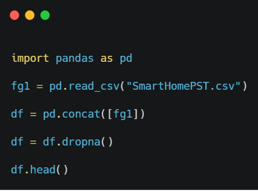

[Regresar](/Programacion-de-Sistemas-Telematicos/)

# Trabajo Autónomo 3 Desarrollo web con base de datos

## 🎯 Objetivo de Aprendizaje
Utilizar tecnologías web basadas en red para el monitoreo del estado y la información de los dispositivos telemáticos.

**Recursos:** Oracle VirtualBox/VMware. Ubuntu. Servicio Web. Node.js. REACT.

**Duración:** 8 horas.

**Instrucciones**

- El formato del trabajo tiene habilitado recuadros para que llenen las respuestas.
- Los trabajos se reciben hasta la fecha planificada en el SIDWeb.
- Coloque el nombre del archivo así “PST_TAA_GrupoB_Apellido1_ApellidoN”, siendo A el número del trabajo, B el número del grupo, N el último apellido del integrante del grupo.
- Una vez que haya desarrollado el trabajo, cada integrante del grupo contestará la encuesta de evaluación de los trabajos autónomos ingresando al enlace https://forms.gle/d2p61cJrjd2ZFqsu8 

**Introducción**
JavaScript es un robusto lenguaje de programación que se puede aplicar a un documento HTML y usarse para crear interactividad dinámica en los sitios web. Esto incluye:
- Interfaces de Programación de Aplicaciones del Navegador (APIs) — APIs construidas dentro de los navegadores que ofrecen funcionalidades como crear dinámicamente contenido HTML y establecer estilos CSS, hasta capturar y manipular un vídeo desde la cámara web del usuario, o generar gráficos 3D y muestras de sonido.
- APIs de terceros, que permiten a los desarrolladores incorporar funcionalidades en sus sitios de otros proveedores de contenidos como Twitter o Facebook.
- Marcos de trabajo y librerías de terceros que puedes aplicar a tu HTML para que puedas construir y publicar rápidamente sitios y aplicaciones.
Mientras que MySQL es un sistema de gestión de base de datos relacional de software libre, que se fundamenta en el lenguaje de consultas estructurado SQL. Entre sus ventajas figura la facilidad de su ejecución en los principales sistemas operativos (Windows, Linux y sus distribuciones). Así como también su asociación con aplicativos móviles y web.

## ACTIVIDADES

1) Utilice Windows o una máquina virtual con la distribución de Ubuntu.

2) Descargue el dataset [Netflix Userbase](../trabajo3/Netflix%20Userbase.csv).

**Acerca del dataset:**
- El conjunto de datos proporciona una instantánea de una muestra de la base de usuarios de Netflix, mostrando diversos aspectos de las suscripciones de los usuarios, los ingresos, los detalles de la cuenta y la actividad. Cada fila representa a un usuario único, identificado por su ID de usuario. El conjunto de datos incluye información como el tipo de suscripción del usuario (Básica, Estándar o Premium), los ingresos mensuales generados por su suscripción, la fecha en la que se unió a Netflix (Fecha de suscripción), la fecha de su último pago (Fecha del último pago) y el país en el que se encuentra. 
- Se han incluido columnas adicionales para proporcionar información sobre el comportamiento y las preferencias de los usuarios. Estas columnas incluyen el tipo de dispositivo (por ejemplo, Smart TV, móvil, ordenador de sobremesa, tableta), el tiempo total de visionado (en minutos) y el estado de la cuenta (si la cuenta está activa o no). El conjunto de datos es una representación sintética y no refleja los datos reales de los usuarios de Netflix. Se puede utilizar para el análisis y el modelado con el fin de comprender las tendencias de los usuarios, las preferencias y la generación de ingresos dentro de una hipotética base de usuarios de Netflix.

3) Diseñe el modelo entidad-relación, incluyendo entidades, atributos, tipos de atributos, tipos de datos, relacionales, cardinalidad.

4) Utilice la línea de comandos de Postgre para crear una base de datos con el nombre “Netflix Userbase”. Cree las tablas correspondientes para registrar los datos importados. 

5) Para el manejo del dataset puede hacer uso de Python con el siguiente código:

  

6) Importación del dataset a las tablas correspondientes en Postgre. Nota: Usted puede modificar el contenido del dataset previo a la importación.

7) Desarrolle una aplicación web con backend en Node.js y frontend en REACT, para presentar los resultados de las siguientes consultas:

- Coloque el enlace del repositorio de GitHub con su código fuente.

- Presente el número de usuarios que se suscribieron a Netflix por cada año.

- Presente en una gráfica en barras los usuarios por países que utilizan Tablet.

- Presente el número de pagos que han realizado los usuarios que se encuentran en United States.

Nota: Argumente las respuestas explicando el proceso de creación de la página web incluyendo las imágenes. Para una mejor presentación de los datos use estilos CSS.

## 📚 Referencias
- [Kaggle](https://www.kaggle.com/datasets/arnavsmayan/netflix-userbase-dataset)