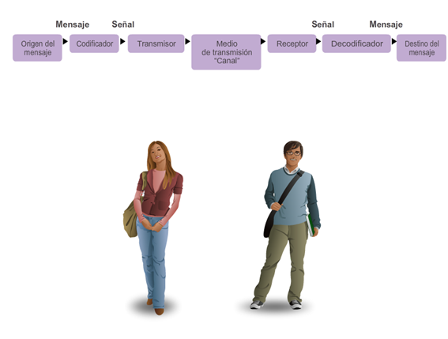
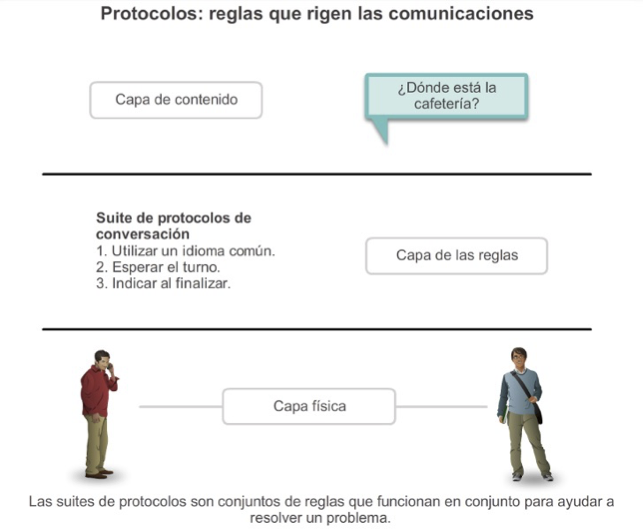
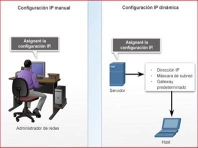
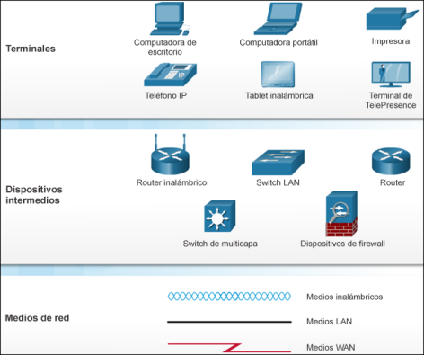

[Regresar](/Programacion-de-Sistemas-Telematicos/)

# Unidad 1: Introducción a sistemas telemáticos

## 🎯 Objetivo de Aprendizaje
Efectuar cálculos de direccionamiento IP usando diagramas de arquitectura para la comunicación entre diferentes redes.

# 1.1. Arquitectura de comunicación de datos
- [¿Qué es la Red?](#definicion)
    - [Redes locales](#redes_locales)
    - [Conexiones](#conexiones)
    - [Datos](#datos)
- [Comunicación en Red](#comunicacion)
- [Protocolos de Red](#protocolos)
- [Componentes de Red](#componentes)
- [¿Qué es un sistema telemático?](#sistema_telematico)
- [Referencias](#referencias)

## 🌐 ¿Qué es la Red?

### **Redes locales**
Las redes locales vienen en todos los tamaños: entre pares (dos dispositivos interconectados) o redes domésticas, hasta redes SOHO y redes de organizaciones grandes.

### **Conexiones**
Todos los tipos de dispositivos se conectan a redes locales.

### **Datos**
La mayoría de la gente utiliza redes para transmitir sus propios datos para compartirlos con otras personas o para almacenarlos a largo plazo.

  

## 🌐 Comunicación en red
- Un emisor y un receptor identificados
- Método de comunicación acordado
- Idioma y gramática común
- Velocidad y momento de entrega
- Requisitos de confirmación o acuse de recibo

  

## 🌐 Protocolos de red
- Formato o estructuración del mensaje.
- Proceso por el cual los dispositivos de red comparten información sobre las rutas con otras redes.
- Cómo y cuándo se transmiten mensajes de error y del sistema entre los dispositivos.
- La configuración y la terminación de sesiones de transferencia de datos.

  

## 🌐 Componentes de Red

  

La configuración IP consta de tres partes, que deben ser correctas para que el dispositivo envíe y reciba información por 
la red:
- Dirección IP: Identifica al host en la red.
- Máscara de subred: Identifica la red a la 
que está conectado el host.
- Gateway predeterminado: Identifica el dispositivo de red que utiliza el host para 
acceder a Internet o a otra red remota.

Una dirección IP puede configurarse manualmente o ser asignada automáticamente por otro dispositivo (DHCP).

  

## 🌐 ¿Qué es un sistema telemático?
Es un sistema compuesto por dispositivos interconectados a la red de datos, diseñados para realizar una función específica siendo una combinación de ambos hardware y software.
imagen
- Puede o no puede contener un sistema operativo para el funcionamiento.
- El firmware es pre-programado y no alterado por el usuario final.
- Los requerimientos de aplicaciones específicas como uso de rendimiento, energía, memoria son factores decisivos.

  

