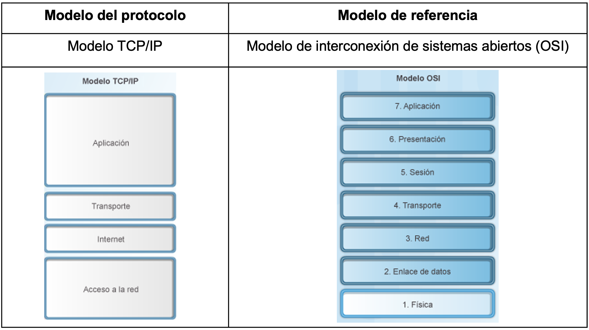

[Regresar](/Programacion-de-Sistemas-Telematicos/)

# Unidad 1: Introducción a sistemas telemáticos

## 🎯 Objetivo de Aprendizaje
Al finalizar la clase el estudiante será capaz de:
- Efectuar cálculos de direccionamiento IP usando diagramas de arquitectura para la comunicación entre diferentes redes.

# 1.2. Modelos de Estructura de Red
- [Modelo de Estructura de Red](#modelo_red)
- [Referencias](#referencias)

## 🌐 Modelos de estructura de red

  

