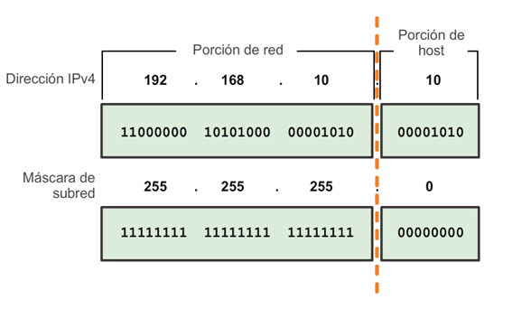
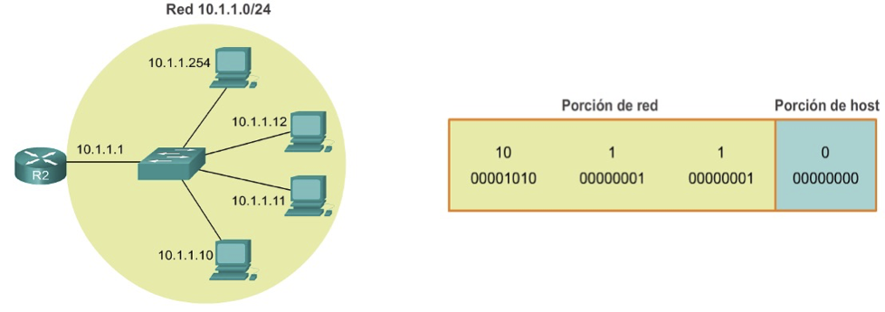

[Regresar](/Programacion-de-Sistemas-Telematicos/)

# Unidad 1: Introducción a sistemas telemáticos

## 🎯 Objetivo de Aprendizaje
Efectuar cálculos de direccionamiento IP usando diagramas de arquitectura para la comunicación entre diferentes redes.

# 1.3. Direccionamiento de protocolo de Internet (IP)
- [Dirección IPv4](#direccion)
- [Conversión de decimal en binario](#conversiondecimal)
- [Máscara de subred IPv4](#mascara_red)
    - [Porción de red y porción de host](#porcion)
    - [Direcciones IPv4 de red, host y broadcast](#direccion_red)
- [Referencias](#referencias)

## 🌐 Dirección IPv4
- La dirección IPv4 tiene 32 bits están agrupados en cuatro bytes de 8 bits llamados octetos. Los octetos se representan en notación decimal punteada.

## 🌐 Conversión de decimal en binario

  

## 🌐 Máscara de subred IPv4

### 🕸️ **Porción de red y porción de host de una dirección IPv4**

  

- Para definir las porciones de red y de host de una dirección, los dispositivos utilizan un patrón de 32 bits separado conocido como “máscara de subred”.
- La máscara de subred no contiene realmente las porciones de red y de host de la dirección IPv4, sino que tan solo indica dónde buscar estas porciones en una dirección IPv4 determinada.

### 🕸️ **Direcciones IPv4 de red, host y broadcast**

  

## Direcciones IPv4 unicast, broadcast y multicast
# Asignación de una dirección IPv4 estática a un host
+ Propiedades de la interfaz LAN
imagen
+ Configuración de una dirección IPv4 estática
imagen
## Direcciones IPv4 unicast, broadcast y multicast
# Asignación de una dirección IPv4 dinámica a un host
DHCP, el método preferido de “concesión” de direcciones IPv4 a hosts en redes grandes, reduce la carga sobre el personal de soporte de red y prácticamente elimina los errores de entrada.
## Direcciones IPv4 unicast, broadcast y multicast
# Transmisión de unicast
En una red IPv4, los hosts pueden comunicarse de tres maneras diferentes:

1. Unicast: proceso por el cual se envía un paquete de un host a un host individual.
Direcciones IPv4 unicast, broadcast y multicast
Transmisión de broadcast
2. Broadcast: proceso por el cual se envía un paquete de un host a todos los hosts en la red. Dirección MAC de broadcast: FFFF:FFFF:FFFF
Direcciones IPv4 unicast, broadcast y multicast
Transmisión de multicast
3. Multicast: proceso por el cual se envía un paquete de un host a un grupo seleccionado de hosts, posiblemente en redes distintas.
+ Se reserva para direccionamiento de grupos multicast: 224.0.0.0 a 239.255.255.255. 
+ Link-local: 224.0.0.0 a 224.0.0.255 (ejemplo: información de enrutamiento que se intercambia mediante protocolos de enrutamiento).
+ Direcciones agrupadas globalmente: 224.0.1.0 a 238.255.255.255 (ejemplo: la dirección 224.0.1.1 se reservó para el protocolo de hora de red).

## Tipos de direcciones IPv4
# Clases de direcciones IPv4
Los bloques de direcciones privadas son los siguientes:
+ Los hosts que no requieren acceso a Internet pueden utilizar direcciones privadas.
+ 10.0.0.0 a 10.255.255.255 (10.0.0.0/8) -> Clase A
+ 172.16.0.0 a 172.31.255.255 (172.16.0.0/12) -> Clase B
+ 192.168.0.0 a 192.168.255.255 (192.168.0.0/16) -> Clase C
+ 11.0.0.0/8, 172.40.0.0/16, 200.93.195.0/24 públicas.
Direcciones de red y de broadcast: no es posible asignar a hosts la primera ni la última dirección de cada red.
# Tipos de direcciones IPv4
imagen
## Prueba y verificación
# Prueba de conectividad a la red
imagen
## Trabajo autónomo 1: División de subredes con direccionamiento IPv4
# Ejercicios en clase
imagen
## Enrutamiento entre redes
# ¿Cómo crear una red LAN?
+ Una red doméstica es una pequeña LAN con dispositivos que generalmente se conectan a un router integrado. 
+ El router está conectado a Internet.
+ Lo más probable es que el router doméstico esté equipado con funcionalidades tanto cableadas como inalámbricas.
## Enrutamiento entre redes
# ¿Cómo crear una red LAN?
imagen
## Topologías de red
## Trabajo autónomo 2: Aprovisionamiento de direcciones IPv4
# Ejercicios en clase
imagen
# Recomendaciones de estudio
+ Lee el material proporcionado por la profesora.
+ Participa en clase en la resolución de los ejercicios.
+ Asiste a las ayudantías de docencia.
+ Investiga, aprende, se parte de la clase.
# Redes inalámbricas
Generalmente, los dispositivos inalámbricos son elementos como teléfonos celulares o asistentes digitales personales, elementos con altos costos y requisitos de energía. 

Sin embargo, una nueva dirección en el diseño de sistemas inalámbricos es extender la conectividad inalámbrica a dispositivos integrados pequeños y de bajo costo para una amplia gama de aplicaciones.

+ ZigBee (IEEE 802.15.4): Baja tasa de envío de datos y maximización de la vida útil de sus baterías.
+ Bluetooth (IEEE 802.15.1): Facilitar las comunicaciones entre equipos móviles.
+ Wi-Fi (IEEE 802.11): Los dispositivos habilitados con wifi pueden conectarse entre sí o a internet.
+ IrDA: Estándar físico en la forma de transmisión y recepción de datos por rayos infrarrojos.
+ RFID: El propósito fundamental de la tecnología RFID es transmitir la identidad de un objeto.
+ GSM, CDMA: Dos principales sistemas de radio utilizados en los teléfonos celulares.
LPWAN: Es un tipo de red de área amplia de telecomunicaciones inalámbricas diseñada para permitir comunicaciones de largo alcance a una tasa de bits baja entre objetos (objetos conectados), como sensores que funcionan con una batería. Entre las tecnologías se encuentra LoRaWAN y Sigfox.
# Administración de Sistemas operativos en red
+ Como todo sistema operativo, Linux tiene exigencias en el hardware donde se ejecutará, es por eso que antes de que se precipite e instale el software, tiene que asegurarse de estos requerimientos y limitaciones de hardware de Linux.

+ Considerando que Linux fue desarrollado por sus usuarios, en la mayoría de las ocasiones el hardware soportado por Linux es únicamente aquél al que usuarios y desarrolladores tiene realmente acceso. Según pasa el tiempo aumenta el hardware soportado por Linux.

+ Un inconveniente en el soporte de hardware bajo Linux, es que muchas compañías han decidido conservar las especificaciones del interfaz de su hardware como propietario. Como consecuencia de esto, los desarrolladores voluntarios de Linux simplemente no pueden escribir controladores (drivers) para estos periféricos (y si pudieran, tales controladores serían propiedad de la compañía dueña de la interfaz, lo cual violaría el GPL).
# Requerimientos de Hardware para el Sistema Operativo Linux
Existe un documento Linux Hardware Compatibility HOWTO que contiene un listado más completo del hardware soportado por Linux en cualquier distribución. El enlace es el siguiente:
http://www.tldp.org/HOWTO/Hardware-HOWTO/

# Requerimientos de Hardware para el Sistema Operativo Linux
CPU
El núcleo Linux soporta las siguientes arquitecturas de procesadores:
+ Alpha: DEC Alpha. Samsung Alpha CPU.
+ ARM: Algunos Modelos de Apple iPod (ver iPodLinux)
+ Algunos celulares Motorola de la Serie Rokr, como Z6 o E2.
+ Freescale: Algunas arquitecturas Amiga: A1200, A2500, A3000, A4000 (generación de ordenadores). Apple Macintosh II, LC, Quadra, Centris y tempranamente Performa series. Estaciones de trabajo Sun Microsystems 3-series (en modo experimental, usa Sun-3 MMU).
+ IBM: System/390 (31-bit). zSeries y System z9 mainframes (64-bit).
+ Intel IA-64 Itanium, Itanium II.
+ x86: Arquitecturas IBM PC compatibles usando procesadores IA-32 y x86-64: Intel 80386, 80486, y AMD, Cyrix, Texas Instruments y variantes IBM. La serie completa Pentium y las variantes Celeron y Xeon. Los procesadores Intel Core . AMD 5x86, K5, K6, Athlon (all 32-bit versions), Duron, Sempron. 
+ SPARC32: Sun-4/SPARCstation/SPARCserver.
## Requerimientos de Hardware para el Sistema Operativo Linux
# Memoria
+ Linux comparado con otros sistemas operativos avanzados, necesita muy poca memoria para funcionar. Debería contar un mínimo recomendable de 4 MB, cuánta más memoria tenga, más rápido funcionará el sistema.

+ La mayoría de los usuarios de Linux, reservan una parte del disco duro para espacio de intercambio “swapping” que se usa como memoria RAM virtual. El área “swap” no puede reemplazar a una memoria física RAM real, pero puede permitir a su sistema ejecutar aplicaciones más grandes guardando en disco duro  aquellas partes de código que están inactivas.
+ La memoria swap es una partición en el disco duro y es recomendado que al momento de instalación se cree dicha partición, aunque es posible asigna una partición swap una vez instalado el sistema operativo.
## Requerimientos de Hardware para el Sistema Operativo Linux
# Disco duro
Los discos duros son algunos de los componentes más importantes de su sistema. Tres diferentes discos duros son comunes en las computadoras modernas: Parallel Advanced Technology Attachment (PATA), también denominado ATA; Serial Advanced Technology Attachment (SATA); y Small Computer System Interface (SCSI). Además, las unidades externas USB e IEEE-1394 están disponibles, así como las variantes externas de las unidades SATA y SCSI. Cada uno tiene su propio método de bajo nivel configuración.
## Requerimientos de Hardware para el Sistema Operativo Linux
# Espacio del disco duro
+ Efectivamente para instalar Linux, necesitará tener algo de espacio libre en su disco duro.  Linux soporta múltiples discos en la misma máquina; puede disponer de espacio para Linux en múltiples unidades de ser necesario.
+ La cantidad de espacio en disco duro que necesitará depende en gran medida de sus necesidades y de la cantidad de software que va a instalar. 
Podría correr un sistema operativo completo con 40 o 50 megabytes de espacio en disco, sin embargo si requiere disponer de espacio para expansiones, y para paquetes más grandes necesitará más espacio.  Si planea permitir a múltiples usuarios utilizar la PC tendría que dejar espacio para sus ficheros.
## Requerimientos de Hardware para el Sistema Operativo Linux
# Tarjetas de red
Linux soporta un buen número de tarjetas de red Ethernet y adaptadores para LAN. A continuación se detalla un resumen de las marcas soportadas de tarjetas de red Ethernet:
+ 3COM
+ AMD LANCE
+ DEC
+ Dlink
+ HP
+ Intel EtherExpress
+ Western Digital
## Selección de la distribución correcta
Para seleccionar la distribución correcta del sistema operativo Linux para un servidor, es necesario considerar los requisitos básicos de hardware:
1. Intel Celeron de 2.4 Ghz como mínimo.
2. Procesador Pentium IV.
3. Tarjetas de Red: 2 NICs PCI Realtek/basadas en chip Realtek o Vía.
4. Disco duro: 40 GB mínimo.
5. Memoria RAM: 4 GB.
## Tipos de Instalación
+ Estación de trabajo: Más adecuada si es nuevo en el mundo de Linux y quiere probarlo. 
+ Servidor: Si desea que su sistema funcione como un servidor basado en Linux utilizando servicios específicos
+ Portátil: Instalación sencilla en ordenadores portátiles. 
+ Personalizada: Mayor flexibilidad en el proceso de instalación. Podrá elegir su esquema de particionamiento, los paquetes que desea instalar y mucho más.
+ Actualización: Para actualizar rápidamente a los últimos paquetes y versiones del kernel. 
## Particiones en un disco duro para Linux 
+ Hay tres clases de particiones: primarias, extendidas y lógicas.
+ Muchas distribuciones necesitan que se creen a mano las particiones de Linux utilizando el programa fdisk. Otras pueden crearlas automáticamente.
+ En el primer sector del disco está el registro de arranque maestro “MBR” junto a la tabla de particiones.
## Particiones en un disco duro para Linux 
En Linux los manejadores, que se encuentran en el directorio /dev, se usan para comunicarse con los dispositivos de su sistema como discos duros. Los discos duros SCSI se nombran con /dev/sda. Los discos duros IDE se nombran /dev/hda y las particiones son /dev/hda1, /dev/hda2, etc.
## Particiones en un disco duro para Linux 
Durante la instalación del Sistema Operativo Linux para un servidor de la red empresarial, es recomendable realizar el particionamiento del disco duro de manera personalizada. Por lo general se crean dos particiones para Linux, una para ser usada como sistema de ficheros raíz y la otra como espacio de intercambio “swap”.
La partición swap, es un espacio de intercambio de ayuda a la memoria RAM a pasar datos temporalmente al disco duro. El tamaño de la partición swap depende de la RAM virtual que necesite, es decir por lo general se crea una partición swap del doble de espacio de su RAM física. A continuación se detalla el particionamiento del disco duro de 80 GB:
Herramientas de Simulación de Sistemas Operativos
1. VirtualBox: https://www.virtualbox.org
2. Vmware: https://www.vmware.com
3. Microsoft Azure: https://azure.microsoft.com/
## Trabajo autónomo 3: Instalación de Ubuntu
# Iniciando la instalación
La instalación del sistema operativo a través de los CD's o DVD, solo se necesita tener este medio de instalación e insertarlo en la unidad lectora de CD-ROM / DVD-ROM y seguir las instrucciones. 

Ubuntu: https://ubuntu.com/download/desktop 
## Instalación de Ubuntu
+ Las versiones Linux basadas en Red Hat cuentan con un asistente gráfico llamado Anaconda.
+ Seleccione el idioma predeterminado que tendrá el sistema operativo como se muestra en la figura.
+ Como próximo paso presione el botón “Instalar Ubuntu”.
## Instalación de Ubuntu
# Configurando el teclado
Seleccione el teclado como se muestra a continuación. Para el idioma Español existen diferentes distribuciones de teclado, las cuales varían por la ubicación de los signos de puntuación. Para conocer la distribución del teclado solo es necesario conocer la ubicación del carácter “@”, para la distribución español el “@” se encuentra en tecla “2”, para la distribución latinoamericana la “@” se encuentra en tecla “Q”.
## Instalación de Ubuntu
# Configurando las particiones
Antes de comenzar la instalación, el asistente solicitará partición del disco duro en la cual se instalará el sistema operativo. Se muestran las siguientes opciones: 
1. Borrar disco e  instalar Ubuntu.- Borra todos sus programas, documentos, fotos, música y demás archivos en todos los sistemas operativos únicamente de la máquina virtual que está creando. 
2. Más opciones.- Permite particionar el disco duro de forma manual.
## Instalación de Ubuntu
# Configurando las particiones
Al seleccionar la opción más opciones, se mostrará la siguiente ventana, que es una herramienta para particionar el disco duro. Para crear una partición, presione el botón “Nueva tabla de particiones”.
+ Después se mostrará una ventana de diálogo en la cual  deberá pulsar en “Continuar” para configurar las particiones, como se muestra en la segunda imagen.
+ Posteriormente presione el botón con el signo “+” que se encuentra en la esquina inferior izquierda.

A continuación se mostrará una ventana en donde se pueden cambiar las siguientes opciones:
Tamaño (MB).-Define el tamaño en Megabytes (MB) de la  partición.
Tipo de la nueva partición.- Se presentan dos opciones: lógica o primaria. Las particiones lógicas se recomiendan para el directorio raíz y para la memoria de intercambio (swap).
Punto de montaje.- Define el sistema de archivos que se instalará en ésta partición.
## Instalación de Ubuntu
# Configurando la zona horaria
En esta parte se recomienda seleccionar la ubicación en la cual se encuentra la computadora para configurar la zona horaria, esto con el fin de tener sincronizada y al tiempo la hora del equipo.
# Configurando la contraseña de administrador
Definir la contraseña de root con privilegios de administrador, se recomienda que esta contraseña contenga caracteres alfanuméricos.
# Bienvenido a Ubuntu
Finalmente, espere a que se realice la instalación de Ubuntu para poder hacer uso del sistema operativo.
# Recomendaciones de estudio
+ Lee el material proporcionado por la profesora.
+ Participa en clase en la resolución de los ejercicios.
+ Asiste a las ayudantías de docencia.
+ Investiga, aprende, se parte de la clase.
