[Regresar](/Programacion-de-Sistemas-Telematicos/)

# Unidad 1: Introducción a sistemas telemáticos

## 🎯 Objetivo de Aprendizaje
Al finalizar la clase el estudiante será capaz de:
- Efectuar cálculos de direccionamiento IP usando diagramas de arquitectura para la comunicación entre diferentes redes.

# 1.3. Direccionamiento de protocolo de Internet (IP)
- [Dirección IPv4](#direccion)
- [Conversión de decimal en binario](#conversiondecimal)
- [Estructura de dirección IPv4](#estructura)
    - [Porción de red y porción de host](#porcion)
    - [Direcciones IPv4 de red, host, y broadcast](#direccion_red)
- [Asignación de una dirección IPv4 estática a un host](#estatica)
- [Asignación de una dirección IPv4 dinámica a un host](#dinamica)
- [Transmisión de mensajes en la red](#transmision)
- [Clases de direcciones IPv4](#clases_direcciones)
- [Conectividad a la red](#conectividad)
- [¿Cómo crear una red LAN?](#lan)
- [Topologías de red](#topologias)
- [Internet: Mapa de cables submarinos](#internet)
- [Administración de sistemas operativos en red](#sistemas_operativos)
  - [Recursos computacionales para Linux](#recursos)
  - [Tipos de Instalación](#instalacion)
  - [Particiones en un disco duro](#particiones)
  - [Herramientas de virtualización](#herramientas_virtualizacion)
- [Referencias](#referencias)


<a name="direccion"> </a>

## 🌐 Dirección IPv4

- La dirección IPv4 tiene 32 bits están agrupados en cuatro bytes de 8 bits llamados octetos. Los octetos se representan en notación decimal punteada.


<a name="conversiondecimal"> </a>

## 🌐 Conversión de decimal en binario

<p align="center">
  
</p>

<a name="estructura"> </a>

## 🌐 Estructura de dirección IPv4

<a name="porcion"> </a>

<p align="center">
  
</p>

- Para definir las porciones de red y de host de una dirección, los dispositivos utilizan un patrón de 32 bits separado conocido como “máscara de subred”.
- La máscara de subred no contiene realmente las porciones de red y de host de la dirección IPv4, sino que tan solo indica dónde buscar estas porciones en una dirección IPv4 determinada.

<p align="center">
  
</p>


<a name="direccion_red"> </a>

### 🕸️ Direcciones IPv4 de red, host, y broadcast

<p align="center">
  
</p>


<a name="estatica"> </a>

## 🌐 Asignación de una dirección IPv4 estática a un host
Las direcciones IP estáticas se utilizan en situaciones específicas en las que se requiere una dirección IP fija y constante para un dispositivo o una red. Algunos casos comunes en los que se recomienda el uso de direcciones IP estáticas son:

- Servidores: Los servidores, como servidores web, de correo electrónico o de base de datos, a menudo requieren una dirección IP estática para garantizar que siempre estén disponibles en la misma dirección.

- Dispositivos de red: Algunos dispositivos de red, como enrutadores, switches o firewalls, pueden requerir direcciones IP estáticas para configuraciones específicas, como el enrutamiento o la administración remota.

- Acceso remoto: Si necesitas acceder a tu red o dispositivo de forma remota desde ubicaciones externas, es más conveniente tener una dirección IP estática para facilitar el acceso y evitar la necesidad de actualizar constantemente la dirección IP en las configuraciones de acceso remoto.

- Configuraciones de seguridad: Al implementar medidas de seguridad, como listas de control de acceso (ACL) o cortafuegos, tener direcciones IP estáticas simplifica la configuración y el mantenimiento de las reglas de seguridad.

- Dispositivos con requisitos específicos: Algunos dispositivos o aplicaciones pueden requerir una dirección IP estática debido a requisitos de configuración específicos. Por ejemplo, cámaras de seguridad IP, dispositivos de monitoreo remoto o sistemas de automatización industrial pueden necesitar direcciones IP estáticas para su correcto funcionamiento.

Es importante tener en cuenta que el uso de direcciones IP estáticas puede requerir una configuración manual. Además, asegúrate de que la dirección IP estática que elijas no entre en conflicto con otras direcciones IP en tu red para evitar problemas de conectividad.

<p align="center">
  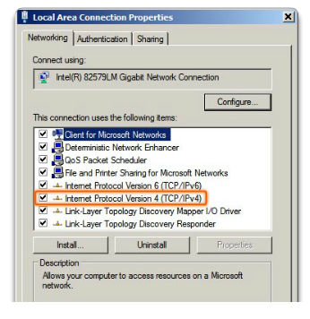
</p>

<p align="center">
  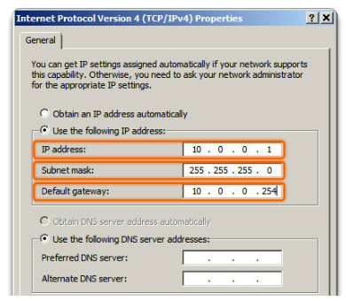
</p>


<a name="dinamica"> </a>

## 🌐 Asignación de una dirección IPv4 dinámica a un host

Las direcciones IP dinámicas se utilizan en situaciones en las que la asignación de direcciones IP cambia con el tiempo. A continuación, te mencionaré algunos casos comunes en los que se utilizan las direcciones IP dinámicas:

- Redes domésticas: En la mayoría de los hogares, los proveedores de servicios de Internet (ISP) asignan direcciones IP dinámicas a los routers o módems de banda ancha. Estas direcciones IP pueden cambiar cada vez que se reinicia el router o después de un período de tiempo determinado. Esto permite que los proveedores de servicios de Internet utilicen un grupo limitado de direcciones IP y las compartan entre varios clientes.

- Redes empresariales: Las redes empresariales a menudo utilizan direcciones IP dinámicas para los dispositivos internos. Esto facilita la administración de la red y permite que los dispositivos se conecten y desconecten sin problemas sin tener que asignar manualmente direcciones IP estáticas.

- Redes públicas: En lugares públicos como cafeterías, aeropuertos, hoteles, etc., donde muchas personas se conectan a la misma red, se suelen utilizar direcciones IP dinámicas. Esto permite que los dispositivos se conecten y obtengan una dirección IP temporal mientras están conectados, y luego la dirección se libera cuando se desconectan.

- Proveedores de servicios de Internet móvil: Los proveedores de servicios de Internet móvil a menudo utilizan direcciones IP dinámicas para los dispositivos móviles que se conectan a su red. Esto les permite administrar eficientemente el uso de direcciones IP en su red, ya que hay un gran número de dispositivos móviles que se conectan y desconectan constantemente.

En resumen, las direcciones IP dinámicas se utilizan en situaciones donde la asignación flexible de direcciones IP es necesaria para adaptarse a los cambios en la conexión de dispositivos a la red.

<p align="center">
  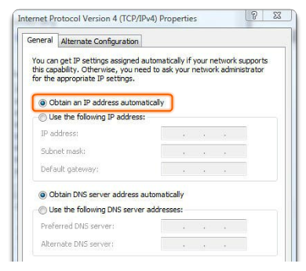
</p>

<p align="center">
  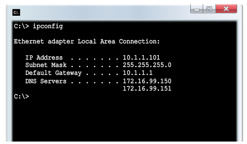
</p>


<a name="transmision"> </a>

## 🌐 Transmisión de mensajes en la red

En una red IPv4 los hosts pueden comunicarse de tres maneras diferentes:

***1. Unicast:*** Se envía un paquete de un host a un host individual.

<p align="center">
  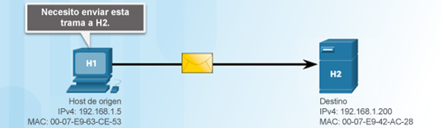
</p>

***2. Broadcast:*** Se envía un paquete de un host a todos los hosts en la red. Dirección MAC de broadcast: FFFF:FFFF:FFFF

<p align="center">
  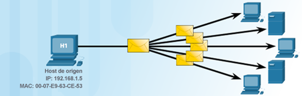
</p>

***3. Multicast:*** Se envía un paquete de un host a un grupo seleccionado de hosts, posiblemente en redes distintas.

<p align="center">
  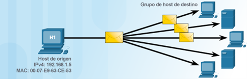
</p>

- Se reserva para direccionamiento de grupos multicast: 224.0.0.0 a 239.255.255.255.

- Link-local: 224.0.0.0 a 224.0.0.255 (ejemplo: información de enrutamiento que se intercambia mediante protocolos de enrutamiento).

- Direcciones agrupadas globalmente: 224.0.1.0 a 238.255.255.255 (ejemplo: la dirección 224.0.1.1 se reservó para el protocolo de hora de red).


<a name="clases_direcciones"> </a>

## 🌐 Clases de direcciones IPv4
Los hosts que no requieren acceso a Internet pueden utilizar direcciones privadas. Los bloques de direcciones privadas son los siguientes:
- Clase A: 10.0.0.0 a 10.255.255.255 (10.0.0.0/8)
- Clase B: 172.16.0.0 a 172.31.255.255 (172.16.0.0/12)
- Clase C: 192.168.0.0 a 192.168.255.255 (192.168.0.0/16)

Ejemplo de redes públicas: 11.0.0.0/8, 172.40.0.0/16, 200.93.195.0/24.

Importante: No es posible asignar a hosts la primera ni la última dirección de cada red (direcciones de red y de broadcast).

<p align="center">
  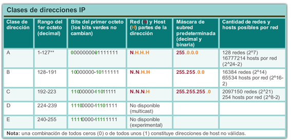
</p>

<p align="center">
  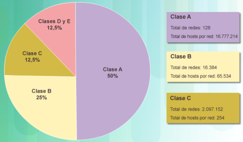
</p>


<a name="conectividad"> </a>

## 🌐 Conectividad a la red

<p align="center">
  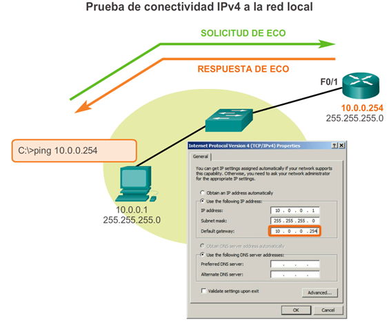
</p>

```
adi@host-200-126-27-173 ~ % ping www.espol.edu.ec -c 10
PING www.espol.edu.ec (192.188.59.149): 56 data bytes
64 bytes from 192.188.59.149: icmp_seq=0 ttl=254 time=8.977 ms
64 bytes from 192.188.59.149: icmp_seq=1 ttl=254 time=6.928 ms
64 bytes from 192.188.59.149: icmp_seq=2 ttl=254 time=6.693 ms
64 bytes from 192.188.59.149: icmp_seq=3 ttl=254 time=7.502 ms
64 bytes from 192.188.59.149: icmp_seq=4 ttl=254 time=7.028 ms
64 bytes from 192.188.59.149: icmp_seq=5 ttl=254 time=6.997 ms
64 bytes from 192.188.59.149: icmp_seq=6 ttl=254 time=7.433 ms
64 bytes from 192.188.59.149: icmp_seq=7 ttl=254 time=7.103 ms
64 bytes from 192.188.59.149: icmp_seq=8 ttl=254 time=7.673 ms
64 bytes from 192.188.59.149: icmp_seq=9 ttl=254 time=8.110 ms
--- www.espol.edu.ec ping statistics ---
10 packets transmitted, 10 packets received, 0.0% packet loss
round-trip min/avg/max/stddev = 6.693/7.444/8.977/0.646 ms
```

<a name="lan"> </a>

## 🌐 ¿Cómo crear una red LAN?
- Una red doméstica es una pequeña LAN con dispositivos que generalmente se conectan a un router integrado. 
- El router está conectado a Internet.
- Lo más probable es que el router doméstico esté equipado con funcionalidades tanto cableadas como inalámbricas.

<p align="center">
  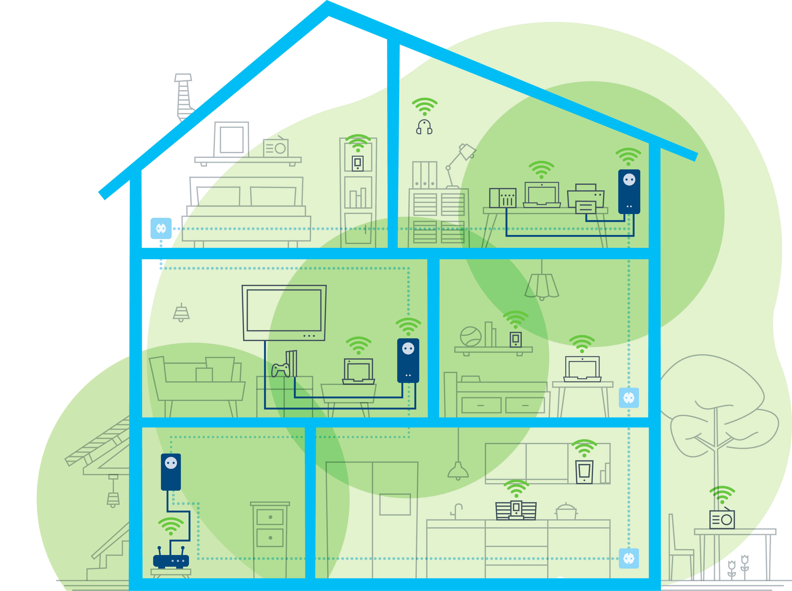
</p>


<a name="topologias"> </a>

## 🌐 Topologías de red
Las topologías de red están compuestas de dispositivos intermedios y finales de la red. En que cada dispositivo de red tiene configurado direccionamiento IPv4.

<p align="center">
  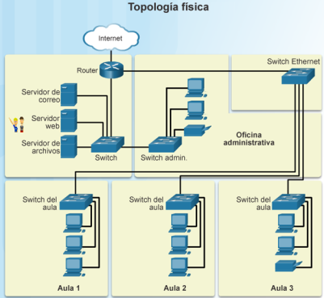
</p>

<p align="center">
  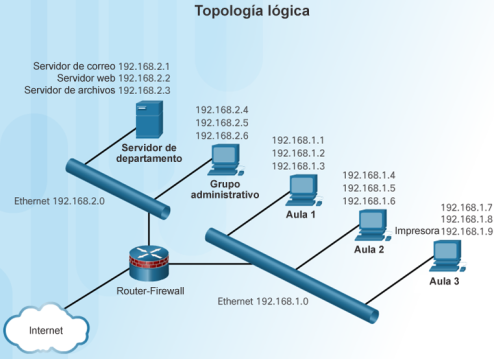
</p>


<a name="internet"> </a>

## 🌐 Internet: Mapa de cables submarinos

**South Pacific Cable System (SPSC)/Mistral**
- RFS: 2021 August
- Cable Length: 7,300 km
- Owners: América Móvil (Claro), Telxius
- Suppliers: SubCom
- Landing Points: 
  - Arica, Chile
  - Valparaíso, Chile
  - Salinas, Ecuador
  - Puerto San Jose, Guatemala
  - Lurin, Peru

<p align="center">
  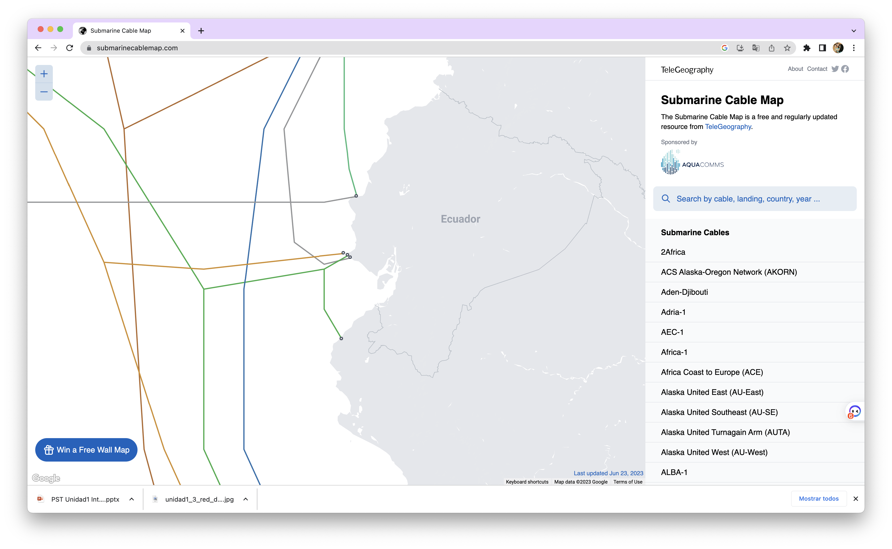
</p>


<a name="sistemas_operativos"> </a>

## 🌐 Administración de sistemas operativos en red
- Como todo sistema operativo, Linux tiene exigencias en el hardware donde se ejecutará, es por eso que antes de que se precipite e instale el software, tiene que asegurarse de estos requerimientos y limitaciones de hardware de Linux.

- Considerando que Linux fue desarrollado por sus usuarios, en la mayoría de las ocasiones el hardware soportado por Linux es únicamente aquél al que usuarios y desarrolladores tiene realmente acceso. Según pasa el tiempo aumenta el hardware soportado por Linux.

- Un inconveniente en el soporte de hardware bajo Linux, es que muchas compañías han decidido conservar las especificaciones del interfaz de su hardware como propietario. Como consecuencia de esto, los desarrolladores voluntarios de Linux simplemente no pueden escribir controladores (drivers) para estos periféricos (y si pudieran, tales controladores serían propiedad de la compañía dueña de la interfaz, lo cual violaría el GPL).


<a name="recursos"> </a>

### 💻 Recursos computacionales para Linux
Previo a la instalación de una distribución de Linux para un servidor es necesario considerar los recursos básicos de hardware como sigue:

- CPU: Intel Celeron de 2.4 Ghz
 -Procesador: Pentium IV
- Disco duro: 40 GB
- Memoria: 4 GB
- Tarjetas de Red: 2 NICs PCI Realtek/basadas en chip Realtek o Via


<a name="instalacion"> </a>

### 💻 Tipos de Instalación
- Estación de trabajo: Más adecuada si es nuevo en el mundo de Linux y quiere probarlo. 
- Servidor: Si desea que su sistema funcione como un servidor basado en Linux utilizando servicios específicos.
- Portátil: Instalación sencilla en ordenadores portátiles. 
- Personalizada: Mayor flexibilidad en el proceso de instalación. Podrá elegir su esquema de particionamiento, los paquetes que desea instalar y mucho más. 
- Actualización: Para actualizar rápidamente a los últimos paquetes y versiones del kernel. 


<a name="particiones"> </a>

### 💻 Particiones en un disco duro
- Hay tres clases de particiones: primarias, extendidas y lógicas.
- Muchas distribuciones necesitan que se creen a mano las particiones de Linux utilizando el programa fdisk. Otras pueden crearlas automáticamente.
- En el primer sector del disco está el registro de arranque maestro “MBR” junto a la tabla de particiones.

<p align="center">
  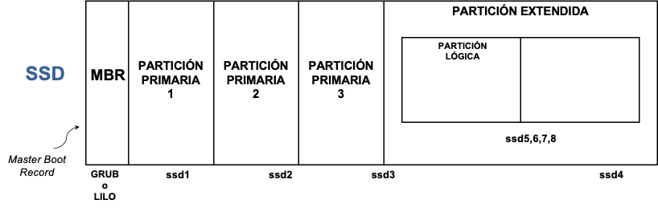
</p>

En Linux los manejadores, que se encuentran en el directorio /dev, se usan para comunicarse con los dispositivos de su sistema como discos duros. Los discos duros SSD se nombran con /dev/disksn.

<p align="center">
  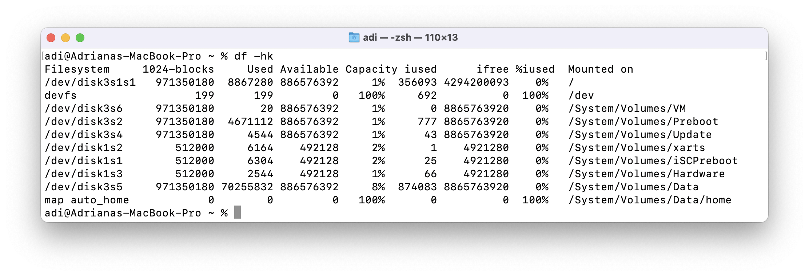
</p>

Por lo general se crean dos particiones para Linux, una para ser usada como sistema de ficheros raíz y la otra como espacio de intercambio “swap”.
La partición swap, es un espacio de intercambio de ayuda a la memoria RAM a pasar datos temporalmente al disco duro.

<p align="center">
  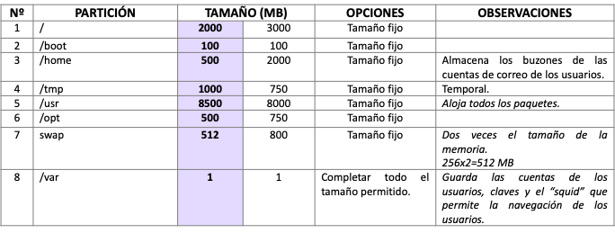
</p>


<a name="herramientas_virtualizacion"> </a>

### 💻 Herramientas de virtualización
- [VirtualBox](https://www.virtualbox.org)
- [Vmware](https://www.vmware.com)
- [Microsoft Azure](https://azure.microsoft.com/)

<p align="center">
  
</p>


<a name="referencias"> </a>

## 📚 Referencias
- [VirtualBox](https://www.virtualbox.org)
- [Vmware](https://www.vmware.com)
- [Microsoft Azure](https://azure.microsoft.com/)
- [Submarine Cable Map from](https://www.submarinecablemap.com/)