## 🎯 Objetivo de Aprendizaje
Utilizar tecnologías web basadas en red para el monitoreo del estado y la información de los dispositivos telemáticos.
## 🌐 Aplicaciones basadas en red

<p align="center">
  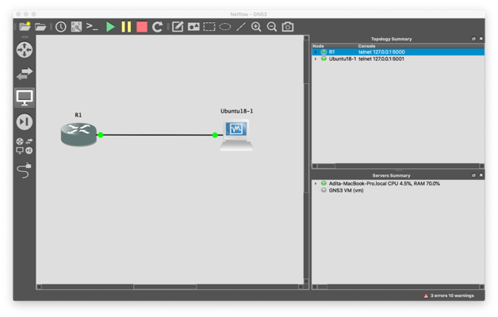
</p>


## 🕸️ Visual Studio Code 
<p align="center">
  
</p>

## 🌐 Aplicaciones basadas en red
+ Editor de código fuente ligero.
+ Disponible para Windows, macOS y Linux.
+ Soporte integrado para JavaScript, TypeScript y Node.js

## 🕸️Virtualización Aplicaciones basadas en red

<p align="center">
  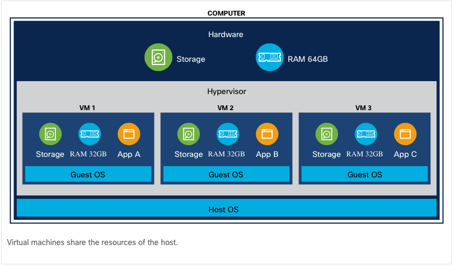
</p>

+ Virtualización es uno de los avances más significativos que ha contribuido a la habilitación de la computación en la nube.
+ Virtualización es el proceso en el que una computadora física, llamada host, ejecuta múltiples copias de un sistema operativo, donde cada copia es llamada guest  (invitado).
+ Cada invitado obtiene sus propios recursos virtuales y se comunica con la red por su cuenta.
+ El sistema host ejecuta un software llamado hypervisor que cambia los recursos entre los distintos invitados.
+ Con el software de compañías como VMWare y Openbox, puede tomar una CPU potente y usarla para ejecutar múltiples máquinas virtuales.
+ Esto optimiza el uso de los recursos físicos y reduce drásticamente los costos con respecto a la máquina anterior, un modelo de sistema operativo.
## 🕸️ Infraestructura basada en contenedores Aplicaciones basadas en red

<p align="center">
  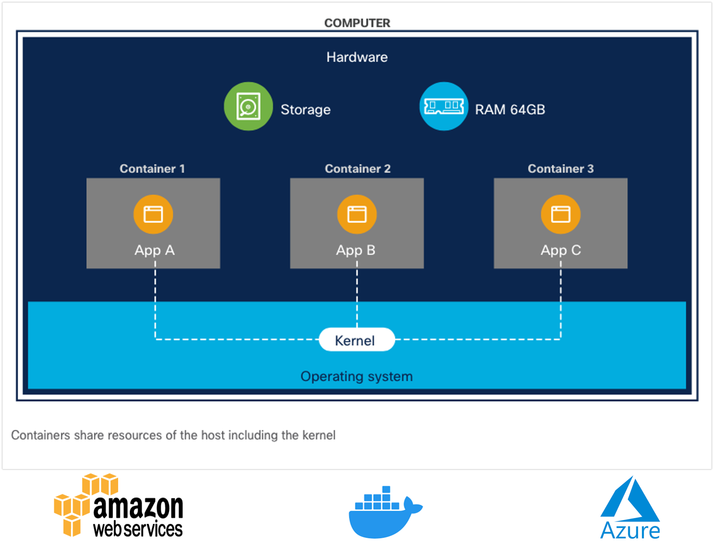
</p>

+ Un contenedor generalmente representa solo una aplicación o un grupo de aplicaciones.
+ El valor de usar contenedores es que se incluyen todas las bibliotecas y binarios que necesita para ejecutar la aplicación, por lo que el usuario no tiene que realizar ese paso de instalación adicional.
+ El software para crear y administrar u orquestar contenedores está disponible en Docker, AWS (Elasticized Container Service), Microsoft (Azure Container Service) y otros.
+ Los programadores están creando software que realiza una única función de un sistema (como el procesamiento o almacenamiento de la base de datos) que se ejecuta en un contenedor.
+ Estos contenedores están organizados en "pods" que se ejecutan dentro de un "nodo" y pueden comunicarse entre sí y con el mundo exterior si es necesario.
+  Linux es la tecnología subyacente que hace que la tecnología de contenedores funcione.
+ Bare-Metal Deployment, es un sistema informático o una red en la que una máquina virtual se instala directamente en el hardware en lugar de dentro del sistema operativo (SO) del host.
# 🌐Frontend – Backend

<p align="center">
  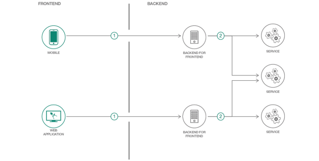
</p>

## 🕸️ Mensajes de estado HTTP

<p align="center">
  
</p>

### Pre-requisitos
## 🌐HTML (Hypertext Markup Language)

<p align="center">
  
</p>

+ HTML no es un lenguaje de programación. Es un lenguaje de marcado que le d ice a los navegadores web cómo estructurar las páginas web que visita.
+ HTML consta de una serie de elementos que se utilizan para encerrar, envolver o marcar diferentes partes del contenido para que aparezca o actúe de una determinada manera.
+ Las etiquetas adjuntas pueden convertir el contenido en un hipervínculo para conectarse a otra página, poner palabras en cursiva, etc.

### 🕸️ Pre-requisitos
# 🌐 CSS (Cascading Stylesheets)

<p align="center">
  
</p>
+ Se usa para darle estilos y diseño a la página web. Por ejemplo, puede usar CSS para modificar la fuente, el color, el tamaño y el espaciado de su contenido, dividirlo en varias columnas o agregar animaciones y otras características decorativas.

### 🕸️ Pre-requisitos
## 🌐 JavaScript (JS)


<p align="center">
  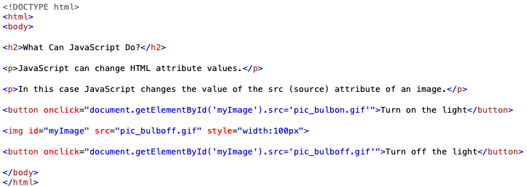
</p>


<p align="center">
  
</p>

+ JavaScript es un lenguaje dinámico de múltiples paradigmas con tipos y operadores, objetos estándar integrados y métodos. 

+ Su sintaxis se basa en los lenguajes Java y C; muchas estructuras de esos lenguajes también se aplican a JavaScript. 

+ JavaScript admite la programación orientada a objetos con prototipos de objetos, en lugar de clases

Referencias: https://developer.mozilla.org/en-US/docs/Web/JavaScript/A_re-introduction_to_JavaScript

## Backend - Creación de API REST con Node.js

<p align="center">
  
</p>

Referencia: https://nodejs.org/

¿Qué es Node.js?
+ Entorno de ejecución de código en JavaScript para el servidor.
+ Asíncrono.
+ Con E/S de datos en una arquitectura orientada a eventos.
+ Basado en el motor  V8 de Google Chrome.

### ¿Cómo utilizar Node.Js?

+ Uso de sockets.
+ Servidores locales o remotos.
+ Conexiones a bases de datos.
+ Creación de servicios REST Create-Read-Update-Delete

### ¿Quién usa Node.js?
+ Netflix
+ PayPal
+ LinkedIn
+ Uber
+ Ebay

### Express

<p align="center">
  
</p>

+ Es una infraestructura de aplicaciones web Node.js mínima y flexible que proporciona un conjunto sólido de características para las aplicaciones web y móviles.
+ Con miles de métodos de programa de utilidad HTTP y middleware a su disposición, la creación de una API sólida es rápida y sencilla.
imagen
### Arquitectura de Node.Js

<p align="center">
  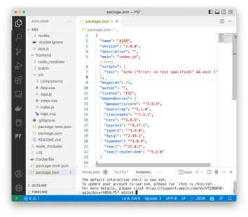
</p>

+ package.json: Generalmente en la raíz del proyecto, contiene metadatos sobre su aplicación o modulo, así como la lista de dependencias.
+ El comando npm install es usado para instalar dependencias y módulos.
### Arquitectura de Node.js

<p align="center">
  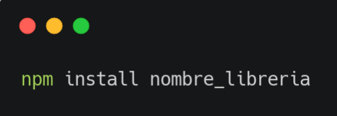
</p>

NPM (Node Package Manager): Gestor de paquetes por defecto de Node.js.
### Arquitectura de Node.js
<p align="center">
  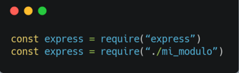
</p>

Require: Es un función que incluye módulos que existen en archivos separados. Lee un archivo JavaScript, ejecuta el archivo y luego procede a devolver el objetivo exportado. Permite importar librerías propias de la arquitectura de Node, librerías externas y nuestros propios módulos. 

### Rutas del API en Node.js

<p align="center">
  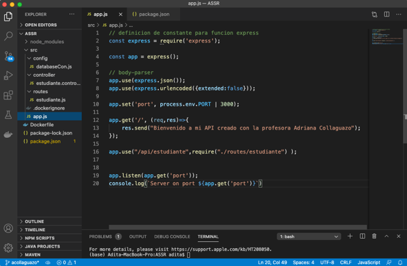
</p>

En el código mostrado que se encuentra en la ruta PST>src>app.js se define el puerto, la ruta raíz del servidor web, que definen las rutas del API.
imagen

### Métodos GET, POST en Node.js

<p align="center">
  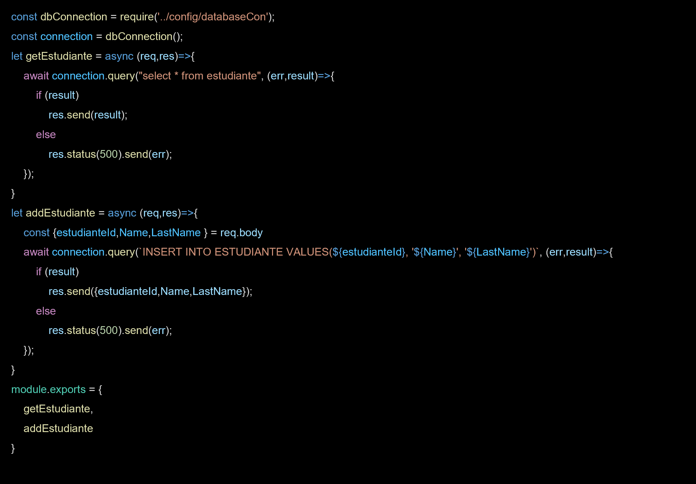
</p>

Definir en la ruta PST>src>controller>estudiante.controller.js los métodos GET, POST para el API.

## Promesas

+ Las promesas nos brindan una forma de darle sentido al comportamiento asincrónico. 
+ Al realizar una solicitud asincrónica, puede suceder una de dos cosas: todo sale como esperamos o hay un error.
+ Las promesas facilitan el manejo de solicitudes asincrónicas, lo cual es bueno, porque tenemos que lidiar con muchos datos asincrónicos en JavaScript.
+ Por ejemplo: Creemos una promesa asincrónica para cargar datos desde la API randomuser.me. Esta API tiene información como dirección de correo electrónico, nombre, número de teléfono, ubicación, etc.
### Rutas del API en Node.js
<p align="center">
  
</p>

Programar las rutas del API, en PST>src>routes>estudiante.js
imagen
### Conexión a la base de datos de MySQL
<p align="center">
  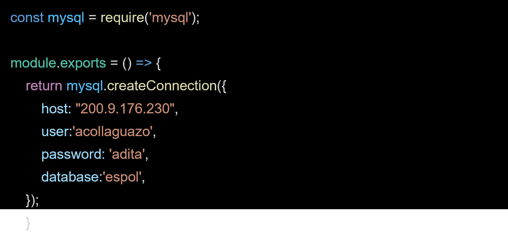
</p>

Hacer la conexión a la base de MySQL con código JavaScript en la ruta PST>src>conf>databaseCon.js
imagen
### Pruebas desde cliente Web

<p align="center">
  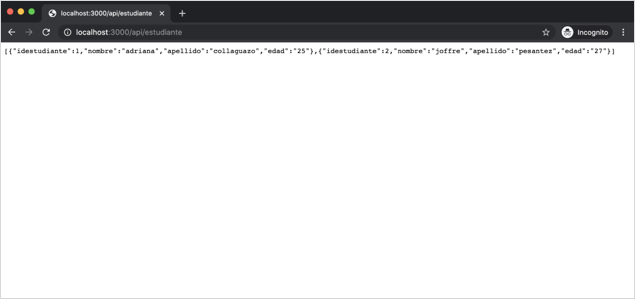
</p>

Probar en el navegador web la URL http://localhost:3000/api/estudiante
imagen
### Backend - PHP

<p align="center">
  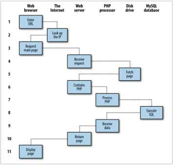
</p>


Para las páginas web dinámicas, el procedimiento es un poco más complicado, ya que puede incluir PHP y MySQL en la mezcla.
imagen
### USING PHP Y MYSQL
+ Con PHP, es simple incrustar una actividad dinámica en páginas web. Cuando le das a las páginas la extensión .php, tienen acceso instantáneo al lenguaje de script.
    <?php
  	echo " Today is " . date("l") . ". ";
?>
Here's the latest news.

+ El resultado final de las dos partes se ve así:
	Today is Wednesday. Here's the latest news.
+ MySQL, de uso gratuito e instalado en un gran número de servidores web de Internet, es un sistema de gestión de bases de datos robusto y excepcionalmente rápido.
+ La verdadera belleza de PHP, MySQL, JavaScript (a veces ayudado por jQuery u otros frameworks), CSS y HTML5 es la maravillosa forma en que todos trabajan juntos para producir contenido web dinámico: PHP maneja todo el trabajo principal en el servidor web, MySQL gestiona todos los datos, y la combinación de CSS y JavaScript se ocupa de la presentación de la página web.
### ¿Qué es WAMP, MAMP, O LAMP?
+ WAMP: “Windows, Apache, MySQL, y PHP”
+ MAMP: “Mac, Apache, MySQL, y PHP”
+ LAMP: “Linux, Apache, MySQL, y PHP”
Estas abreviaturas describen una configuración totalmente funcional utilizada para desarrollar páginas web dinámicas de Internet.
## Frontend -  Framework (marco de trabajo)


### **Ember:**
<p align="center">
  
</p>

Es un framework más antiguo, tiene buena popularidad debido a su estabilidad, soporte de la comunidad y algunos principios de codificación inteligentes.
imagen
### **Angular:**

<p align="center">
  
</p>

Es un framework de aplicaciones web y móviles de código abierto.

### **VUE:**
<p align="center">
  
</p>

Extiende HTML con algo de su propio código. Aparte de eso, se basa principalmente en JavaScript estándar y moderno.

### **REACT:**

<p align="center">
  
</p>
Es una biblioteca para renderizar componentes de UI. React se usa en combinación con otras bibliotecas para hacer aplicaciones web.


### Frontend -  REACT
+ La creación de una aplicación React se trata de componentes.
+ Un componente individual de React se puede considerar como un componente de IU en una aplicación.
+ Los componentes de React son objetos reutilizables.
+ En React, la interfaz de usuario se expresa con funciones puras.
+ Escribe código que parece HTML directamente en su JavaScript.


### Frontend -  REACT


Hay tres formas de declarar componentes de React:

(1) Como clases de ES6. Estas clases formalizan el patrón común de JavaScript.¨

```
class HelloWorld extends React.Component { render() { return(<p>Hello, world!</p>) }
```

(2) Importación y uso del método createReactClass ().


<p align="center">
  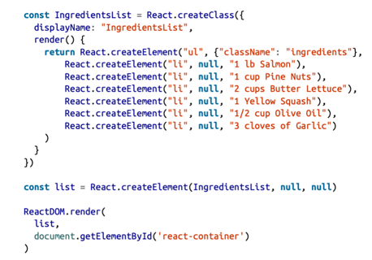
</p>

(3) Los componentes funcionales sin estado son funciones, no objetos que toman propiedades y devuelven un elemento DOM. El Modelo de objetos de documento (DOM) se refiere al árbol HTML del navegador que forma una página web.

```
const IngredientsList = props => React.createElement("ul", {className: "ingredients"}, 
props.items.map((ingredient, i) => React.createElement("li", { key: i }, ingredient) ) ) 
```

## Herramientas de Desarrollo Web

<p align="center">
  
</p>


### **Código fuente de la página web:**

<p align="center">
  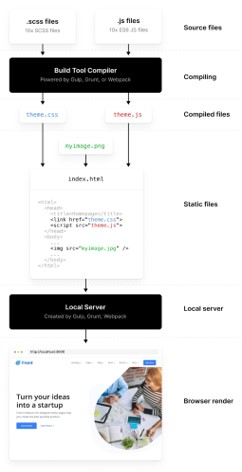
</p>

En una página web dar clic derecho, luego seleccionar la opción “Inspeccionar código fuente”.

### **Bootstrap:**


 Es un marco CSS gratuito y de código abierto para el desarrollo web y móvil. Contiene plantillas de diseño basadas en CSS y JavaScript para tipografía, formularios, botones, navegación y otros componentes de la interfaz.
 https://getbootstrap.com
### **Documentación de código fuente para informes.**

https://carbon.now.sh

### Recomendaciones de estudio
+ Lee el material proporcionado por la profesora.
+ Participa en clase en la resolución de los ejercicios.
+ Asiste a las ayudantías de docencia.  
+ Investiga, aprende, se parte de la clase.

## Introducción a los sistemas de gestión de bases de datos
+ Hay una variedad de sistemas de administración de bases de datos disponibles para Linux. Estos incluyen sistemas de gestión de bases de datos de alto nivel comercial, como Oracle, DB2 de IBM y Sybase.
+ Las bases de datos de código abierto de Linux también están disponibles, como MySQL y PostgreSQL. Estos están entre los más utilizados en los sistemas Linux. La mayor parte de los sistemas de administración de base de datos disponibles para Linux, están diseñados para soportar grandes bases de datos relacionales.
El propósito de una base de datos es ayudar a las personas a dar seguimiento a las cosas. Las aplicaciones clásicas de bases de datos se refieren al seguimiento de artículos tales como órdenes, clientes, empleos, empleados.
El “DataBase Management System” (DBMS) procesa la base de datos, y lo utilizan tanto los programadores como los usuarios, quienes pueden ingresar al DBMS directa o indirectamente.
imagen
Figura 3. Componentes de un sistema de bases de datos
## Introducción a los sistemas de gestión de bases de datos


<p align="center">
  
</p>

El ciclo de desarrollo de sistemas de bases de datos contiene los siguientes pasos:

+ Requerimientos: Pueden ser de 3 tipos de requerimientos escritos, verbales, formularios.
+ Modelo lógico: Pueden existir varios métodos como jerárquico/árbol, red, relacional (modelo entidad relación), objeto, internet.
+ Modelo físico
+ Desarrollo
+ Implantación
+ Retroalimentación
## Modelo lógico
### Modelo entidad/relación


Los elementos claves del modelo entidad-relación son entidades, atributos y relaciones.     

Entidad: Es un objeto sobre el cual se requiere mantener o almacenar información. Ejemplos: facultad, alumno, materia, ciudad, item. Los tipos de entidades son: sujeto (empleado), objeto (articulo), evento (pedido), lugar (pais).

FACULTAD       CARRERA         MATERIA


Atributo: Las entidades tienen atributos o propiedades, como a veces se les llama, que describen las características de la entidad. Por ejemplo: 

<p align="center">
  
</p>

Tipos de Atributos
	Clave primaria: #
	Obligatorio: *
	Opcional: O
	Foráneo: F
	Clave primaria foránea: F#

<p align="center">
  
</p>

Relaciones:

	1 : 1 
	1 : N
	N : M

<p align="center">
  
</p>

<p align="center">
  
</p>


Figura 8. UML (Lenguaje de Modelado Unificado) del Diagrama de Entidad/Relación del Sistema Académico

<p align="center">
  
</p>

Figura 9. UML del Diagrama de Entidad/Relación de un Sistema Musical
https://www.lucidchart.com/

## Estructura y diseño de base de datos relacional

<p align="center">
  
</p>


## SQL (Structured Query Language)


SQL es el lenguaje utilizado por la mayoría de los sistemas de gestión de base de datos relacional (RDBMSs), incluidos MySQL y PostgreSQL. Aunque muchos RDBMS usan herramientas administrativas para administrar bases de datos, en Linux MySQL y PostgreSQL.

<p align="center">
  
</p>

Referencia: https://www.w3schools.com/sql/default.asp

## MySQL
+ MySQL es un sistema de gestión de bases de datos relacional desarrollado bajo licencia GPL/Licencia comercial por Oracle Corporation. 
+ MySQL está estructurado en un modelo cliente/servidor con un daemon de servidor (mysqld) que llena solicitudes de programas cliente. MySQL está diseñado para velocidad, confiabilidad y facilidad de uso. Se pretende que sea un sistema de gestión de bases de datos rápido para bases de datos grandes y, al mismo tiempo, fiable, adecuado para un uso intensivo.
+ Está considerada como la base datos open source más popular del mundo.
## Servicio de MySQL
### Instalación
+ Para la instalación de MySQL se realizan los siguientes pasos:
1. Instale MySQL y active el servicio.

root@ubuntu:/home/ubuntu# apt-get install mysql-server
root@ubuntu:/home/ubuntu# service mysqld start

### Creación de usuarios en MySQL
+ Para crear un usuario en MySQL:

```
	mysql> CREATE USER 'acollaguazo'@'localhost' IDENTIFIED BY 'adi’;
	Query OK, 0 rows affected (0.07 sec)
```
+ Se otorga permisos al nuevo usuario:

```
mysql> GRANT ALL ON *.* TO 'acollaguazo'@'locahost' IDENTIFIED BY 'adi’;
	Query OK, 0 rows affected (0.00 sec)
```

+ Se refrescan todos los privilegios:

```
mysql> FLUSH PRIVILEGES;
```

+ Se accede con el usuario 
```
acollaguazo a MySQL:
[root@localhost admin]# mysql -u acollaguazo -p
Enter password: 
	Welcome to the MySQL monitor.  Commands end with ; or \g.
	Your MySQL connection id is 8
	Server version: 5.6.36 MySQL Community Server (GPL)
	Copyright (c) 2000, 2017, Oracle and/or its affiliates. All rights reserved.
	Oracle is a registered trademark of Oracle Corporation and/or its
	affiliates. Other names may be trademarks of their respective owners.
	Type 'help;' or '\h' for help. Type '\c' to clear the current input statement.
```

+ Para eliminar un usuario existente de MySQL:

```
	mysql> DROP USER 'admin'@'localhost’;
	Query OK, 0 rows affected (0.00 sec)
```

# Usando msqladmin

Puede utilizar mysqladmin para realizar varias acciones:
+ Restaurar o mejorar la seguridad de la cuenta root.
+ Determinar el estado del servidor MySQL mientras está ejecutándose.
+ Apagar el servidor para actualización o reemplazos de componentes de hardware por emergencias.

Ejemplos:

[root@linux acollaguazo]# mysqladmin -u root -p password ‘clave’

[root@linux acollaguazo]# mysqladmin –p ping

[root@linux acollaguazo]# mysqladmin –p shutdown

## Servicio de MySQL
# Inicio de sesión
+ Configure una clave para brindar seguridad a la base de datos, con el comando mysqladmin:

```
[root@linux acollaguazo]# mysqladmin -u root -p password 'linux'
	Enter password:
	Warning: Using a password on the command line interface can be insecure.
```

+ Inicie sesión en MySQL CLI usando el usuario root y la clave linux:

```
[root@linux acollaguazo]# mysql -u root -p
	Enter password:
	Welcome to the MySQL monitor.  Commands end with ; or \g.
	Your MySQL connection id is 7
	Server version: 5.6.35 MySQL Community Server (GPL)
 	Copyright (c) 2000, 2016, Oracle and/or its affiliates. All rights reserved.
 	Oracle is a registered trademark of Oracle Corporation and/or its
	affiliates. Other names may be trademarks of their respective
	owners.
 	Type 'help;' or '\h' for help. Type '\c' to clear the current input statement.
 	mysql>
```

## Servicio de MySQL
# Recuperación de contraseña del usuario root de MySQL


1. Detener el servicio de MySQL:

```
[root@localhost ~]# service mysql stop
Redirecting to /bin/systemctl stop  mysqld.service
```

2. Iniciar el servicio MySQL de forma diferente que no pida clave:
```
	[root@localhost ~]# mysqld_safe --skip-grant-tables &
	[1] 12235
	[root@localhost ~]# 171113 16:29:12 mysqld_safe Logging to '/var/log/mysqld.log’.
	171113 16:29:13 mysqld_safe Starting 
```

3. Acceder a la terminal de MySQL:	
```	
	[root@localhost ~]# mysql -u root –p
	Enter password: Welcome to the MySQL monitor.  Commands end with ; or \g.
	Your MySQL connection id is 1
	Server version: 5.6.36 MySQL Community Server (GPL)
	Copyright (c) 2000, 2017, Oracle and/or its affiliates. All rights reserved.	
	Oracle is a registered trademark of Oracle Corporation and/or its affiliates. Other names may be trademarks of their respective owners.
	Type 'help;' or '\h' for help. Type '\c' to clear the current input statement.
	mysql>
	(*) No les pedirá clave, verán que ya entraron a la consola o terminal de MySQL.

	```


4. Proceder a cambiar la clave del root de MySQL. Primero entraremos a la base de datos de MySQL y cambiamos la clave:

     mysql> use mysql;
     Reading table information for completion of table and column names
     You can turn off this feature to get a quicker startup with –A
     Database changed   
     mysql> update user set password=PASSWORD("adi") where user='root’;
     Query OK, 4 rows affected (0.01 sec)Rows matched: 4  Changed: 4    
     Warnings: 0
```
5. Refrescar los privilegios:

```
     mysql> flush privileges;
     Query OK, 0 rows affected (0.00 sec)
```

6. Salir del terminal de MySQL:
```
	mysql> quit;
	Bye
```

7. Finalmente, cambiar la clave del usuario root de MySQL, y ahora vamos a reiniciar el servicio de MySQL:

```
     [root@localhost ~]# service mysqld restart     
     Redirecting to /bin/systemctl restart  mysqld.service
     Job for mysqld.service failed. See 'systemctl status  
     mysqld.service' and 'journalctl -xn' for details.
```

## Servicio de MySQL
# Creación de base de datos
### **Creación de una base de datos:**
```
	mysql> create database routing;
	Query OK, 1 row affected (0,01 sec)
 	
	mysql> show databases;
	+--------------------+
	| Database           |
	+--------------------+
	| information_schema |
	| mysql              |
	| performance_schema |
	| routing            |
	+--------------------+
	4 rows in set (0,02 sec)
	
	mysql> use routing;
	Database changed
```

## Creación de tabla
**Creación de tabla:**

```
mysql> create table servidor (id int not null primary key auto_increment, ip varchar (20), netmask varchar(20), gateway varchar (20));
Query OK, 0 rows affected (0,15 sec)
 
mysql> show tables;
+-------------------+
| Tables_in_routing |
+-------------------+
| servidor          |
+-------------------+
1 row in set (0,01 sec)
 
mysql> describe servidor;
+---------+-------------+------+-----+---------+----------------+
| Field   | Type        | Null | Key | Default | Extra          |
+---------+-------------+------+-----+---------+----------------+
| id      | int(11)     | NO   | PRI | NULL    | auto_increment |
| ip      | varchar(20) | YES  |     | NULL    |                |
| netmask | varchar(20) | YES  |     | NULL    |                |
| gateway | varchar(20) | YES  |     | NULL    |                |
+---------+-------------+------+-----+---------+----------------+
4 rows in set (0,01 sec)
```

**Mostrar la tabla creada:**

```
mysql> show create table servidor;
+----------+-------------------------------------------------------------------------------+
| Table    | Create Table                                                                                                                                                                                                                             
+----------+-------------------------------------------------------------------------------+
| servidor | CREATE TABLE `servidor` (
  `id` int(11) NOT NULL AUTO_INCREMENT,
  `ip` varchar(20) DEFAULT NULL,
  `netmask` varchar(20) DEFAULT NULL,
  `gateway` varchar(20) DEFAULT NULL,
  PRIMARY KEY (`id`)
) ENGINE=InnoDB AUTO_INCREMENT=2 DEFAULT CHARSET=latin1 |
+----------+-------------------------------------------------------------------------------+
1 row in set (0,02 sec)

```
## Ingreso de Registros

**Inserción de registros en la tabla**

```
mysql> insert into servidor values (null,"200.93.195.2","255.255.255.0","200.93.195.1");
Query OK, 1 row affected (0,09 sec)
 
mysql> select * from servidor;
+----+--------------+---------------+--------------+
| id | ip           | netmask       | gateway      |
+----+--------------+---------------+--------------+
|  1 | 200.93.195.2 | 255.255.255.0 | 200.93.195.1 |
+----+--------------+---------------+--------------+
1 row in set (0,01 sec)

```
## Modificación de tabla

**El cambio de nombre de una tabla, como cualquier otro cambio en la estructura o meta información sobre una tabla, se logra mediante el comando ALTER.**

```
	mysql> ALTER TABLE red RENAME network;
	Query OK, 0 rows affected (0.08 sec)
	mysql> show tables;
	+--------------------+
	| Tables_in_netlinux |
	+--------------------+
	| network            |
	| servidor           |
	+--------------------+
	2 rows in set (0.00 sec)

	mysql> select * from network;
	+----+-------------+-------------------+---------------+---------------+--------------+
	| id | servidor_id | dirmac            | dirip         | mascara       | defgw        |
	+----+-------------+-------------------+---------------+---------------+--------------+
	|  1 |           1 | 08:00:27:82:a7:2b | 200.93.195.21 | 255.255.255.0 | 200.93.195.1 |
	+----+-------------+-------------------+---------------+---------------+--------------+
	1 row in set (0.01 sec)

```

## Servicio de MySQL
# Modificando el tipo de datos de una columna

**El cambio del tipo de datos de una columna también utiliza el comando ALTER, esta vez junto con la palabra clave MODIFY.**

```
mysql> ALTER TABLE network MODIFY dirip varchar(30);
	Query OK, 1 row affected (0.16 sec)
	Records: 1  Duplicates: 0  Warnings: 0

	mysql> describe network;
	+-------------+-------------+------+-----+---------+----------------+
	| Field       | Type        | Null | Key | Default | Extra          |
	+-------------+-------------+------+-----+---------+----------------+	
	| id          | int(11)     | NO   | PRI | NULL    | auto_increment |
	| servidor_id | int(11)     | NO   | MUL | NULL    |                |
	| dirmac      | varchar(30) | YES  |     | NULL    |                |
	| dirip       | varchar(30) | YES  |     | NULL    |                |
	| mascara     | varchar(16) | NO   |     | NULL    |                |
	| defgw       | varchar(16) | NO   |     | NULL    |                |
	+-------------+-------------+------+-----+---------+----------------+

```

## Agregando una nueva columna
**Supongamos que ha creado una tabla y la ha llenado con muchos datos, solo para descubrir que necesita una columna adicional. No es para preocuparse. A continuación, se muestra cómo agregar la nueva columna:**

```
mysql> ALTER TABLE network ADD dired VARCHAR(30);
	Query OK, 0 rows affected (0.12 sec)
	Records: 0  Duplicates: 0  Warnings: 0

	mysql> describe network;
	+-------------+-------------+------+-----+---------+----------------+
	| Field       | Type        | Null | Key | Default | Extra          |
	+-------------+-------------+------+-----+---------+----------------+
	| id          | int(11)     | NO   | PRI | NULL    | auto_increment |
	| servidor_id | int(11)     | NO   | MUL | NULL    |                |
	| dirmac      | varchar(30) | YES  |     | NULL    |                |
	| dirip       | varchar(30) | YES  |     | NULL    |                |
	| mascara     | varchar(16) | NO   |     | NULL    |                |
	| defgw       | varchar(16) | NO   |     | NULL    |                |
	| dired       | varchar(30) | YES  |     | NULL    |                |
	+-------------+-------------+------+-----+---------+----------------+
	7 rows in set (0.00 sec)
	
```

# Eliminando una columna
### **Para eliminar una columna use la palabra clave DROP:**

```
mysql> ALTER TABLE network DROP dired;
	Query OK, 0 rows affected (0.14 sec)
	Records: 0  Duplicates: 0  Warnings: 0

	mysql> describe network;
	+-------------+-------------+------+-----+---------+----------------+
	| Field       | Type        | Null | Key | Default | Extra          |
	+-------------+-------------+------+-----+---------+----------------+
	| id          | int(11)     | NO   | PRI | NULL    | auto_increment |
	| servidor_id | int(11)     | NO   | MUL | NULL    |                |
	| dirmac      | varchar(30) | YES  |     | NULL    |                |
	| dirip       | varchar(30) | YES  |     | NULL    |                |
	| mascara     | varchar(16) | NO   |     | NULL    |                |
	| defgw       | varchar(16) | NO   |     | NULL    |                |
	+-------------+-------------+------+-----+---------+----------------+
	7 rows in set (0.00 sec)

```

## Modificando un registro
**Esta construcción le permite actualizar el contenido de un campo. Si desea cambiar el contenido de uno o más campos, primero debe delimitar solo el campo o los campos que se van a modificar, de la misma manera que usa el comando SELECT.**

```
mysql> UPDATE network SET dirip='200.93.195.18' WHERE id='1’;
	Query OK, 1 row affected (0.06 sec)
	Rows matched: 1  Changed: 1  Warnings: 0

	mysql> select * from network;
	+----+-------------+-------------------+---------------+---------------+--------------+
	| id | servidor_id | dirmac            | dirip         | mascara       | defgw        |
	+----+-------------+-------------------+---------------+---------------+--------------+
	|  1 |           1 | 08:00:27:82:a7:2b | 200.93.195.18 | 255.255.255.0 | 200.93.195.1 |
	+----+-------------+-------------------+---------------+---------------+--------------+
	1 row in set (0.00 sec)

```

## Eliminando un registro
**Cuando necesite eliminar una fila de una tabla, use el comando DELETE.**


```
mysql> DELETE FROM network WHERE id=1;

	mysql> select * from network;
	+----+-------------+-------------------+---------------+---------------+--------------+
	| id | servidor_id | dirmac            | dirip         | mascara       | defgw        |
	+----+-------------+-------------------+---------------+---------------+--------------+
	|  1 |           1 | 08:00:27:82:a7:2b | 200.93.195.18 | 255.255.255.0 | 200.93.195.1 |
	+----+-------------+-------------------+---------------+---------------+--------------+
	1 row in set (0.00 sec)

```

## Query using the WHERE, LIKE keywords

La palabra clave WHERE le permite restringir las consultas al devolver solo aquellas en las que cierta expresión es verdadera. También puede hacer una coincidencia de patrones para sus búsquedas usando el calificador LIKE, que permite búsquedas en partes de cadenas. Este calificador se debe usar con un carácter % antes o después de algún texto. Cuando se coloca antes de una palabra clave,% significa cualquier carácter.

```
mysql> select dirip from network where dirip LIKE "200.%";
	+---------------+
	| dirip         |
	+---------------+
	| 200.93.195.18 |
	+---------------+
	1 row in set (0.00 sec)

```

## Query using JOIN
**Si desea especificar la columna en la que unir dos tablas, utilice el comando JOIN… ON:**


```
	mysql> select nombresrv,dirip FROM servidor JOIN network WHERE servidor.id=network.servidor_id;

	mysql> select nombresrv,dirip FROM servidor JOIN network ON servidor.id=network.servidor_id;

	+-----------+---------------+
	| nombresrv | dirip         |
	+-----------+---------------+
	| srv_dns1  | 200.93.195.18 |
	+-----------+---------------+
	1 row in set (0.00 sec)

```
## Respaldo y restauración de los datos
Con mysqldump, puede volcar una base de datos o una colección de bases de datos en uno o más archivos que contengan todas las instrucciones necesarias para volver a crear todas sus tablas y repoblarlas con sus datos. También puede generar archivos en CSV (valores separados por comas) y otros formatos de texto delimitados, o incluso en formato XML. Su principal inconveniente es que debe asegurarse de que nadie escriba sobre una tabla mientras la respalda.
Hay varias formas de hacerlo, pero lo más fácil es bajar el servicio de MySQL antes de mysqldump y reiniciar el servidor una vez que mysqldump termine.

```
[root@localhost admin]# mysqldump -u root –padi netlinux > netlinux.sql
Warning: Using a password on the command line interface can be insecure.

[root@localhost admin]# ls
menu.sh  netlinux.sql

```

<p align="center">
  
</p>

## Exportación de datos hacia un archivo CSV

Dado a que la información que se almacena en la base de datos es valiosa para la empresa, es importante realizar respaldos de la información períodicamente.
```
mysql> select * from servidor;
+----+-----------+-------------+
| id | nombresrv | marca       |
+----+-----------+-------------+
|  1 | srv_dns1  | HP          |
|  2 | srv_dns2  | HP          |
|  3 | srv_dhcp  | HP          |
|  4 | srv_ftp   | IBM         |
|  5 | srv_nfs   | Mikrotik    |
|  6 | srv_www   | Super Micro |
|  7 | srv_ntp   | IBM         |
|  8 | srv_db    | IBM         |
+----+-----------+-------------+
8 rows in set (0.00 sec)

mysql> SELECT * FROM servidor INTO OUTFILE '/tmp/bkpmysqlservidor.csv' FIELDS TERMINATED BY ',' ENCLOSED BY '"' LINES TERMINATED BY '\n';
ERROR 1290 (HY000): The MySQL server is running with the --secure-file-priv option so it cannot execute this statement
mysql> show variables like "secure_file_priv";
+------------------+-----------------------+
| Variable_name    | Value                 |
+------------------+-----------------------+
| secure_file_priv | /var/lib/mysql-files/ |
+------------------+-----------------------+
1 row in set (0.14 sec)

mysql> LOCK TABLES servidor READ;

mysql> SELECT * FROM network INTO OUTFILE '/var/lib/mysql-files/bkpmysqlservidor.csv' FIELDS TERMINATED BY ',' ENCLOSED BY '"' LINES TERMINATED BY '\n';
Query OK, 8 row affected (0.07 sec)

[root@localhost mysql-files]# more bkpmysqlservidor.csv "1","srv_dns1","HP""2","srv_dns2","HP""3","srv_dhcp","HP""4","srv_ftp","IBM""5","srv_nfs","Mikrotik""6","srv_www","Super Micro""7","srv_ntp","IBM""8","srv_db","IBM"
```


## Importación de datos desde un archivo CSV

Cuando un componente de hardware del servidor se ha dañado, el proceso de restauración de los datos y de la base de datos completa, es un tarea fácil de realizar cuando se cuenta con los archivos respaldados.

```
mysql> LOCK TABLES servidor READ;

mysql> LOAD DATA LOCAL INFILE '/var/lib/mysql-files/bkpmysqlservidor.csv' INTO TABLE servidor FIELDS TERMINATED BY ',' ENCLOSED BY '"' LINES TERMINATED BY '\n' IGNORE 1 LINES;
Query OK, 2 rows affected (0.01 sec)
Records: 9  Deleted: 0  Skipped: 7  Warnings: 0

mysql> select * from servidor;                                                    
+----+-----------+-------------+
| id | nombresrv | marca       |
+----+-----------+-------------+
|  1 | srv_dns1  | HP          |
|  2 | srv_dns2  | HP          |
|  3 | srv_dhcp  | HP          |
|  4 | srv_ftp   | IBM         |
|  5 | srv_nfs   | Mikrotik    |
|  6 | srv_www   | Super Micro |
|  7 | srv_ntp   | IBM         |
|  8 | srv_db    | IBM         |
|  9 | srv_smb   | HP          |
| 10 | srv_proxy | IBM         |
+----+-----------+-------------+
10 rows in set (0.00 sec)
```

## Normalización

El proceso de normalización de bases de datos consiste en aplicar una serie de reglas a las tablas obtenidas tras el paso del modelo conceptual al modelo lógico.

Las bases de datos relacionales se normalizan para:
Evitar la redundancia de los datos.
Evitar problemas de actualización de los datos en las tablas.
Proteger la integridad de los datos.

En un principio, Codd propuso tres formas normales, a las cuales llamó primera, segunda y tercera formas  normales (1FN, 2FN, 3FN).Posteriormente, Boyce y Codd propusieron una definición más estricta de 3FN, a la que se conoce como  forma normal de Boyce‑Codd (FNBC).

Todas estas formas normales se basan en las dependencias funcionales entre los atributos de una relación. Más adelante se propusieron una cuarta formal (4FN) y una quinta (5FN), con fundamento en los conceptos de dependencias multivaluadas y dependencias de reunión, respectivamente 

<p align="center">
  
</p>


## Redundancia
+ **Almacenamiento Redundante:** Información Repetida 
+ **Anomalías de actualización:** Actualización datos en copias. 
	- Modificar dirección de una sucursal (Inconsistencia).

<p align="center">
  
</p>

**Almacenamiento Redundante:** Información Repetida.

**Anomalías de actualización:** Actualización datos en copias
- Modificar dirección de una sucursal (Inconsistencia).

**Anomalías de Borrado:** Eliminar información sin perder otra.
- Eliminar último empleado de una sucursal.

## MODELO LÓGICO
Incluye varias restricciones (limitaciones) usadas para verificar la validez de los  datos en una base de datos.

+ Integridad de la entidad
+ Integridad referencial
+ Dependencias Funcionales

### **Integridad de la entidad**
El atributo que es clave de una fila en una relación no puede tener un valor nulo.

### **Integridad referencial**
El valor de una clave externa o es nulo o debe ser un valor real de una clave en otra  relación.


<p align="center">
  
</p>

## Dependencia Funcional
+ Ocurre cuando el valor de un atributo o varios determina el valor  de un segundo atributo o varios.
A	     B	**(A determina funcionalmente a B)**
+ El atributo en la parte izquierda de la dependencia funcional es  llamado el determinante.
+ Si conocemos el valor de A podemos conocer el valor de B.

## Dependencia Transitiva
Sean X, Y, Z tres atributos (o grupos de atributos) de la misma entidad. Si Y depende  funcionalmente de X y Z de Y, pero X no depende funcionalmente de Y, se dice que Z depende  transitivamente de X. Simbólicamente sería:

<p align="center">
  
</p>

## PRIMERA FORMA NORMAL (1FN)
Una tabla está en 1FN si satisface las siguientes cinco condiciones:

+ No hay orden de arriba a abajo en las filas.
+ No hay orden de izquierda a derecha en las columnas.
+ No hay filas duplicadas.
+ Cada intersección de fila y columna contiene exactamente un valor del dominio aplicable y nada más.
+ Todas las columnas son regulares, es decir, las filas no tienen componentes como IDs de fila, IDs de objeto, o timestamps ocultos.

La primera forma normal se definió para prohibir los atributos multivaluados, compuestos y sus combinaciones.  

## SEGUNDA FORMA NORMAL (2FN)
Un esquema está en 2FN si:

+ Está en 1NF.
+ Y si todos los atributos no clave dependen funcionalmente de la clave  completa y no sólo de una parte de esta.


+ Este paso sólo se aplica a relaciones que tienen claves compuestas,  es decir, relaciones con una clave principal compuesta de dos o mas  atributos.

+ Una relación con una clave principal de un único atributo está  automáticamente en 2NF


Si una tabla no está en 2FN, se le puede normalizar  a varias relaciones en 2FN en las que los atributos que dependen de una parte de la clave formarán una nueva relación que tendrá esa parte de la clave como clave primaria. 
El atributo restante, Lugar actual de trabajo, es  dependiente solo en parte de la clave candidata, llamada  Empleado. Por lo tanto la tabla no está en 2FN.
¿Cuál es el lugar actual de trabajo de Jones?"

<p align="center">
  
</p>

Sin embargo, no todas las tablas. 
<p align="center">
  
</p>

Aunque el Ganador y la Fecha de nacimiento del ganador están determinadas por una clave completa {Torneo, Año}  y no son partes de ella, particularmente las combinaciones Ganador / Fecha de nacimiento del ganador son  mostradas redundantemente en múltiples registros. Este problema es tratado por la tercera forma normal (3FN).

# 2FN y las claves foráneas

+ Una tabla para la cual no hay dependencias funcionales parciales  en la clave primaria está típicamente, pero no siempre, en 2FN.
+ Una tabla puede contener varias claves foráneas; es necesario  establecer que ningún atributo no-­‐principal tienen dependencias de  claves parciales en cualquiera de estas claves foráneas.

<p align="center">
  
</p>

A pesar de que la clave principal está definida como {Nombre completo del modelo}, la tabla no está en  2FN.
{Fabricante, Modelo} es también una clave foránea, y País del fabricante es un atributo dependiente en  un subconjunto apropiado del Fabricante.

## Tercera forma normal (3FN)

Una tabla está en 3FN si y solo si las dos condiciones siguientes se mantienen:

1. La tabla está en la segunda forma normal (2FN).
2. Ningún atributo no-primario de la tabla es dependiente transitivamente de una clave candidata.

Es decir, una relación está en tercera forma normal si todos los atributos de la relación dependen funcionalmente sólo de la clave, y no de ningún otro atributo.

<p align="center">
  
</p>

La única clave foránea es {Torneo, Año}.
La violación de la 3FN ocurre porque el atributo no primario Fecha de nacimiento del ganador es dependiente transitivamente de {Torneo, Año} vía el atributo no primario Ganador. 
El hecho de que la Fecha de nacimiento del ganador es funcionalmente dependiente del Ganador hace la tabla vulnerable a inconsistencias lógicas, pues no hay nada que impida a la misma persona ser mostrada con diferentes fechas de nacimiento en diversos registros.


Para expresar los mismos hechos sin violar la 3FN, es necesario dividir la tabla en dos:

<p align="center">
  
</p>

<p align="center">
  
</p>

La mayoría de las tablas 3FN están libres de anomalías de actualización, inserción, y borrado.

## ADMINISTRACIÓN DE BASE DE DATOS CON MYSQL WORKBENCH


<p align="center">
  
</p>

### Recomendaciones de estudio

+ Lee el material proporcionado por la profesora.
+ Participa en clase en la resolución de los ejercicios.
+ Asiste a las ayudantías de docencia.
+ Investiga, aprende, se parte de la clase.

“Leer y practicar es la mejor forma de aprender los fundamentos teóricos”.

Autor: Ángel Collaguazo 
