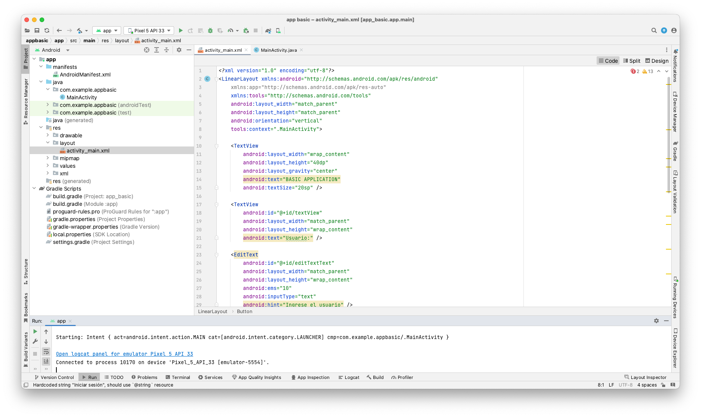
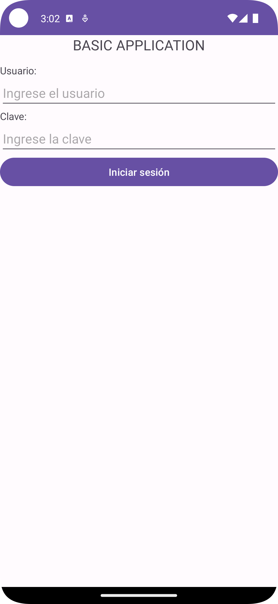

[Regresar](/Programacion-de-Sistemas-Telematicos/)

# Unidad 3 Control móvil de sistemas telemáticos

## 🎯 Objetivo de Aprendizaje
Al finalizar la clase el estudiante será capaz de:
- Utilizar tecnologías web basadas en red para el monitoreo del estado y la información de los dispositivos telemáticos.

# 3.1. Entorno de desarrollo móvil
- [Introducción](#introduccion)
    - [Android](#android)
    - [Estructura del sistema operativo](estructura)
- [Modelo lógico](#modelo)

## 🌐 Introducción
- La principal diferencia técnica entre los sistemas operativos de los dispositivos móviles y los utilizados en los ordenadores portátiles y de sobremesa es que el sistema operativo móvil no es un verdadero sistema multitarea. 
- En los dispositivos móviles, sólo puede estar activa una aplicación a la vez. Cuando se inicia otra aplicación, o ésta es interrumpida por otra (por ejemplo, una llamada telefónica), la aplicación que se estaba ejecutando pasa a segundo plano. Permanece en segundo plano hasta que el usuario accede a ella de nuevo. Si permanece demasiado tiempo en segundo plano, o si la memoria disponible es demasiado escasa, el sistema operativo puede eliminarla.
- Una característica clave de un dispositivo móvil es la capacidad de conocer su entorno actual a través de sensores incorporados. Los dispositivos móviles tienen sensores diseñados para captar dónde

## 🌐 Android

- Proporciona una plataforma para usuarios móviles.
- Carece de los paquetes tradicionales de GNU / Linux para que sea compatible con el escritorio.
+ Patrocinado por Google.

## 🌐 Estructura del sistema operativo

1. Aplicaciones escritas en Java.
2. Arquitectura diseñada para simplificar la reutilización de componentes.
3. Incluye un conjunto de bibliotecas de C/C++ usadas por varios componentes del sistema
4. Incluye un set de bibliotecas base que proporcionan la mayor parte de las funciones disponibles en las bibliotecas base del lenguaje Java.
5. Android depende de Linux para los servicios base del sistema como seguridad, gestión de memoria, gestión de procesos, pila de red y modelo de controladores.

## 🌐Estructura de un proyecto en Android Studio

  

app>java>com.example.myfirstapp>MainActivity
Esta es la actividad principal (el punto de entrada para tu app). Cuando compilas y ejecutas la app, el sistema inicia una instancia de esta Activity y carga su diseño.

app>res>layout>activity_main.xml
Este archivo XML define el diseño correspondiente a la IU de la actividad. Contiene elementos editText y Button.

Gradle Scripts > build.gradle
Dos archivos con este nombre: uno para el proyecto ("Project: MyFirstApp") y otro para el módulo de la "app" ("Module: app"). Cada módulo tiene su propio archivo build.gradle, pero este proyecto por el momento tiene un solo módulo. Trabajarás principalmente con el archivo build.gradle del módulo para configurar la forma en que las herramientas de Gradle compilan y crean tu app.

app>manifests>AndroidManifest.xml
El archivo de manifiesto describe las características fundamentales de la app y define cada uno de sus componentes.

## 🌐Componentes de una aplicación

**Activity**

Las actividades (activities) representa una pantalla con una interfaz de usuario.

**View**
Son los componentes básicos con los que se construyen la interfaz gráfica de la aplicación.

**Service**
Son los componentes sin interfaz gráfica que se ejecutan en segundo plano.

**Content Provider**
Es el mecanismo que se ha definido en Android para compartir datos entre aplicaciones.

**Broadcast Receiver**
Es un componente destinado a detectar y reaccionar ante determinados mensajes o eventos globales generados por el sistema.

**Widget**
Son elementos visuales, interactivos, que pueden mostrarse en la pantalla principal.

**Intent**
Es el elemento básico de comunicación entre los distintos componentes Android, como dos actividades.

## 🌐 Prototipado móvil

## 🌐 Desarrollando una Aplicación

Crear una aplicación donde se ingresa el nombre del usuario y la clave, al dar click en “Login” el usuario ingresará a la aplicación móvil.

  

## 🌐 Interfaz de usuario: Layouts

Un FrameLayout coloca todos sus controles hijos alineados con su esquina superior izquierda, de forma que cada control quedará oculto por el control siguiente. 

Este layout apila uno tras otro todos sus  Elementos hijos de forma horizontal o Vertical según se establezca su propiedad Android:orientation

Un TableLayout permite distribuir sus elementos hijos de forma tabular, definiendo las filas y columnas necesarias, y la posición de cada componente dentro de la tabla.

Este layout permite especificar la posición de cada elemento de forma relativa a su elemento padre o a cualquier otro elemento incluido en el propio layout.

## 🌐 Layouts propiedades   

**Posición relativa a otro control:**

+ Android:layout_above
+ Android:layout_below
+ Android:layout_toLeftOf
+ Android:layout_toRightOf
+ Android:layout_alignLeft
+ Android:layout_alignRight
+ Android:layout_alignTop
+ Android:layout_alignBottom
+ Android:layout_alignBaseline

**Posición relativa al layout padre:**

+ Android:layout_alignParentLeft
+ Android:layout_alignParentRight
+ android:layout_alignParentTop.
+ android:layout_alignParentBotto
+ android:layout_centerHorizontal.
+ android:layout_centerVertical
+ android:layout_centerInParent.

**Opciones de margen**

+ android:layout_margin.
+ android:layout_marginBottom.
+ android:layout_marginTop
+ android:layout_marginLeft.
+ android:layout_marginRight.

**Opciones de espaciado o padding**

+ android:padding.
+ android:paddingBottom.
+ android:paddingTop.
+ android:paddingLeft.
+ android:paddingRight.

## 🌐 Interfaz de usuario: Controles básicos

**El SDK de Android nos proporciona tres tipos de botones:**

+ El clásico (Button)
+ El de tipo on/off (ToggleButton)
+ El que puede contener una imagen (Imagebutton)

## 🌐 Menús en Android
En Android podemos encontrar 3 tipos diferentes de menús:

   + **Menús Principales:** Los más habituales, aparecen en la zona inferior de la pantalla al pulsar el botón ‘menu’ del teléfono.
   + **Submenús** Son menús secundarios que se pueden mostrar al pulsar sobre una opción de un menú principal.
   + **Menús Contextuales:** Útiles en muchas ocasiones, aparecen al realizar una pulsación larga sobre algún elemento de la pantalla.

# 🌐Widgets
Los pasos principales para la creación de un widget Android son los siguientes:
1. Definición de su interfaz gráfica (layout).
2. Configuración XML del widget (AppWidgetProviderInfo).
3. Implementación de la funcionalidad del widget (AppWidgetProvider), especialmente su evento de actualización.
4.  Declaración del widget en el Android Manifest de la aplicación.

El layout de los widgets de Android está basado en un tipo especial de componentes llamados RemoteViews, sin embargo hay unos pocos básicos que se indican acontinuación:

+ **Contenedores**: FrameLayout, LinearLayout, RelativeLayout y GridLayout 

+ **Controles**: Button, ImageButton, ImageView, TextView, ProgressBar,Chronometer, 
AnalogClock y ViewFlipper. A partir de Android 3 también podemos utilizar ListView, GridView, StackView y AdapterViewFlipper. 

## 🌐Tratamiento de XML

Los dos modelos más extendidos son SAX (Simple API for XML) y DOM (Document Object Model).

**SAX en Android**

En el modelo SAX, el tratamiento de un XML se basa en un analizador (parser) que a medida que lee secuencialmente el documento XML va generando diferentes eventos con la información de cada elemento leido.

 Asi, por ejemplo, a medida que lee el XML, si encuentra el comienzo de una etiqueta <title> generará un evento de comienzo de etiqueta, startElement(), con su información asociada, si después de esa etiqueta encuentra un fragmento de texto generará un evento characters() con toda la información necesaria, y así sucesivamente hasta el final del documento.

<noticias>
    <noticia>
        <titulo>T1</titulo>
        <link>L1</link>
    </noticia>
    <noticia>
        <titulo>T2</titulo>
        <link>L2</link>
    </noticia>
</noticias>

## 🌐 Base de Datos en Android Studio

La plataforma Android proporciona dos herramientas principales para el almacenamiento y consulta de datos estructurados:

1. Bases de Datos SQLite
2. Content Providers

SQLite es un motor de bases de datos muy popular en la actualidad por ofrecer características tan interesantes como su pequeño tamaño, no necesitar servidor, precisar poca configuración, ser transaccional y por supuesto ser de código libre.

## 🌐Métodos para operaciones DB

### Método 1

//Insertar un registro
db.execSQL("INSERT INTO Usuarios (codigo,nombre) VALUES (6,'usuariopru') ");
 
//Eliminar un registro
db.execSQL("DELETE FROM Usuarios WHERE codigo=6 ");
 
//Actualizar un registro
db.execSQL("UPDATE Usuarios SET nombre='usunuevo' WHERE codigo=6 ");

### Método 2

### INSERCIÓN

//Creamos el registro a insertar como objeto ContentValues
ContentValues nuevoRegistro = new ContentValues();
nuevoRegistro.put("codigo", "6");
nuevoRegistro.put("nombre","usuariopru");
 
//Insertamos el registro en la base de datos
db.insert("Usuarios", null, nuevoRegistro);

### ACTUALIZACIÓN

//Establecemos los campos-valores a actualizar
ContentValues valores = new ContentValues();
valores.put("nombre","usunuevo");
 
//Actualizamos el registro en la base de datos
db.update("Usuarios", valores, "codigo=6", null);

### ELIMINACIÓN

//Eliminamos el registro del usuario '6'
db.delete("Usuarios", "codigo=6", null);

# Notificaciones: Toast

Un toast es un mensaje que se muestra en pantalla durante unos segundos al usuario para luego volver a desaparecer automáticamente sin requerir ningún tipo de actuación por su parte, y sin recibir el foco en ningún momento (o dicho de otra forma, sin interferir en las acciones que esté realizando el usuario en ese momento). Aunque son personalizables, aparecen por defecto en la parte inferior de la pantalla, sobre un rectángulo gris ligeramente translúcido.

## 🌐 Notificaciones: Barra de Estado

Las notificaciones de la barra de estado de Android. Estas notificaciones son las que se muestran en nuestro dispositivo por ejemplo cuando recibimos un mensaje SMS, cuando tenemos actualizaciones disponibles, cuando tenemos el reproductor de música abierto en segundo plano, … Estas notificaciones constan de un icono y un texto mostrado en la barra de estado superior, y adicionalmente un mensaje algo más descriptivo y una marca de fecha/hora que podemos consultar desplegando la bandeja del sistema.

## 🌐 Notificaciones: Diálogos

Los diálogos de Android los podremos utilizar con distintos fines, en general:

1. Mostrar un mensaje.
2. Pedir una confirmación rápida.
3. Solicitar al usuario una elección (simple o múltiple) entre varias alternativas.

### Diálogo de Alerta

Este tipo de diálogo se limita a mostrar un mensaje sencillo al usuario, y un único botón de OK para confirmar su lectura.

### Diálogo de Confirmación

Un diálogo de confirmación es muy similar al anterior, con la diferencia de que lo utilizaremos para solicitar al usuario que nos confirme una determinada acción, por lo que las posibles respuestas serán del tipo Sí/No.

### Diálogo de Selección

Cuando las opciones a seleccionar por el usuario no son sólo dos, como en los diálogos de confirmación, sino que el conjunto es mayor podemos utilizar los diálogos de selección para mostrar una lista de opciones entre las que el usuario pueda elegir.

# Recomendaciones de estudio

Lee el material proporcionado por la profesora.
Participa en clase en la resolución de los ejercicios.
Asiste a las ayudantías de docencia.
Investiga, aprende, se parte de la clase.

